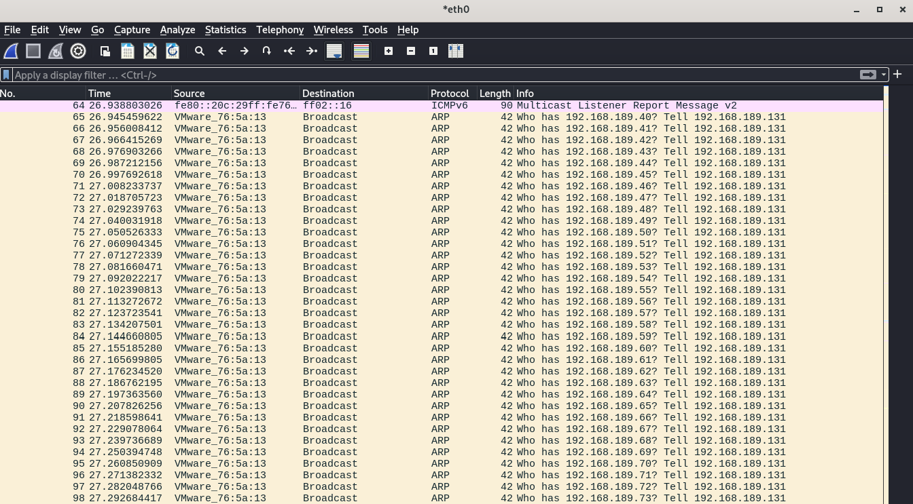
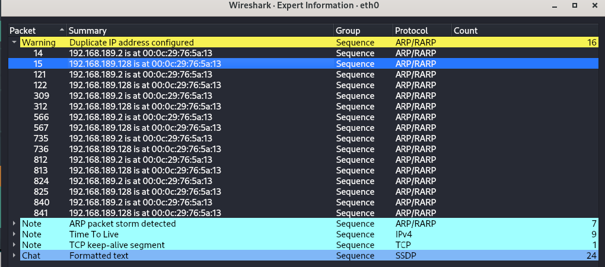
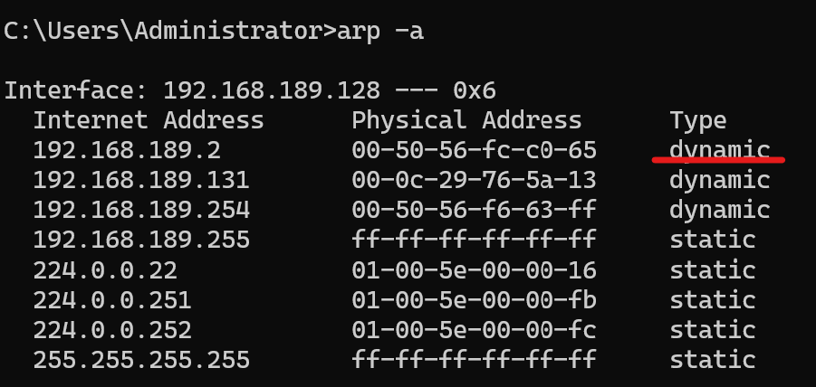

NETWORK HACKING - POST-CONNECTION ATTACKS - INFORMATION GATHERING
===

### <span style = "color: #569cd6">From **Network Hacking** (breaking through the gate) to **System Hacking** (what you do once you are inside the house).</span>


### 1. The Concept: "The Victim Machine"
Before you can learn to hack a computer, you need a computer to attack.
* **The Problem:** If you try to run viruses or exploits on your main computer (your "Host"), you could corrupt your files or lose data.
* **The Solution:** You create a **Virtual Machine (VM)**.
    * Think of this as a "computer inside a computer."
    * If you break the virtual machine, you simply click "delete" and install a new one. Your real computer remains 100% safe.


### 2. Hardware Compatibility Check
A very specific note about **Apple Computers**:
* **Intel Chips (Standard PC/Older Macs):** Follow this video.
* **Apple M-Chips (M1, M2, M3):** You must skip this and watch the next lecture.
    * *Why?* Apple M-chips use a different architecture (ARM). The standard Windows file provided here won't run on them. You need a special ARM version of Windows.

### 3. Sourcing the Windows Image
Usually, to install Windows, you need an ISO file and a license key. However, the instructor suggests a shortcut:
* **Microsoft Developer Images:** Microsoft provides pre-installed, free virtual machines intended for web developers to test the Edge browser.
* **Why use this?** It is free, legal, and pre-configured. You don't have to go through the long Windows installation process (selecting language, region, creating user accounts, etc.).

### 4. The Installation Process (Step-by-Step)
The lecture walks you through a "Import" method rather than an "Install" method.

**Step A: Unzip**
* The file you download is a `.zip` archive (a compressed package).
* **Action:** You must extract (unzip) it first. If you try to open it directly from the zip file, VMware will crash or fail to read the data.

**Step B: Import into VMware**
* Instead of creating a "New Machine," you use the **"Open Virtual Machine"** option.
* You look for the file ending in `.ovf` or `.vmx` inside the unzipped folder.
* **Result:** VMware reads the file and instantly creates the computer with all the settings pre-filled.

### 5. Optimizing Resources (RAM)
The instructor changes the settings immediately after importing.
* **Default Setting:** 4GB of RAM.
* **New Setting:** 2GB of RAM.
* **Why?** Your physical computer (the Host) has a limited amount of RAM. You need to run:
    1.  Your Host OS (Windows/MacOS).
    2.  Your Attacker VM (Kali Linux).
    3.  Your Victim VM (Windows 10).
* If you give the Victim VM too much RAM, your Host or your Kali Linux might slow down or crash. Windows 10 runs perfectly fine on 2GB for testing purposes.

### 6. First Run and Login
* **Default Password:** The instructor notes the password is `Passw0rd!` (Capital P, symbol at the end).
* **Display Settings:**
    * When you first turn it on, the screen might be tiny, or the icons might be huge (especially if you have a 4K monitor).
    * The fix is usually right-clicking the desktop > **Display Settings** and adjusting the resolution to match your monitor.

### Key Vocabulary for this Lecture

* **Snapshot:** The instructor mentions this briefly. A snapshot is like a "Save Point" in a video game. Before you run a virus, you take a snapshot. If the virus destroys the machine, you "Revert to Snapshot," and the machine goes back to exactly how it was before the attack.
* **Host Machine:** Your physical computer.
* **Guest Machine:** The virtual machine (The Windows 10 victim).

### Why this setup is crucial for Post-Connection
In the previous section (WiFi cracking), you were attacking the *router*. Now, you will be attacking the *operating system*. You will learn how to:
1.  Generate a backdoor (a virus).
2.  Send it to this Windows 10 VM.
3.  Execute it.
4.  Take control of the Windows 10 VM from your Kali Linux machine.

---

### <span style = "color: #569cd6">Information Gathering</span>

Think of this like a burglar entering a house. In the previous section, you picked the lock (cracked the WiFi password). Now you are inside the hallway. Before you can steal anything, you need to turn on a flashlight to see which rooms exist and who is home.

### 1. The Goal: Mapping the Network
You cannot hack a target if you don't know it exists. Your first job after connecting to a network (whether wired or WiFi) is to answer:
* Who else is connected here?
* What are their IP addresses?
* What are their MAC addresses?
* Who manufactured their devices (Apple, Dell, Sony, etc.)?

### 2. The Tool: NetDiscover
There is a tool built into Kali Linux called **NetDiscover**.
* **Pros:** It is simple, fast, and great for a quick look around.
* **Cons:** It doesn't give deep details (like what software the targets are running)—that is what `Nmap` is for (which comes next).

### 3. The Command and The Logic
The command used is:
`netdiscover -r [IP Range]`

* **`netdiscover`**: The name of the program.
* **`-r`**: This stands for **Range**. It tells the program, "Don't just look at one IP; look at a whole list of them."

#### Understanding the Range (The `/24` notation)
This is the most technical part of the lecture, but it is easy if you visualize it.

* **Your IP:** Let's say your Kali IP is `10.0.2.15`.
* **The Subnet:** Computers on the same network usually share the first three sets of numbers. So, everyone on this network is `10.0.2.x`.
* **The Target:** You want to scan every number from `10.0.2.1` up to `10.0.2.254`.

Instead of typing all 254 numbers, we use **CIDR notation** (Classless Inter-Domain Routing). We simply type `/24`.


* **Command:** `netdiscover -r 10.0.2.1/24`
* **Translation:** "Scan every device that starts with `10.0.2` and ends with *any* number."

### 4. Scenario A: The Virtual Lab
The instructor first demonstrates this in the safe, virtual environment.
1.  **Setup:** Kali Linux and Windows 10 are both Virtual Machines.
2.  **Connection:** They are connected via a "NAT Network." To them, this looks like a real physical Ethernet cable connecting them.
3.  **Result:** When he runs the command, NetDiscover finds the Windows 10 machine. It shows the IP, the MAC address, and the Vendor.

### 5. Scenario B: The Real World (WiFi Adapter)
The instructor then proves that hacking skills are universal. He switches to a real-world scenario.

* **The Hardware:** He plugs in a **USB Wireless Adapter**. (Remember: Virtual Machines cannot use your laptop's built-in WiFi card directly. They need an external USB adapter to hack WiFi).
* **The Connection:** He connects Kali Linux to his real home WiFi network.
* **The New IP:** His home network uses the range `192.168.1.x`.
* **The New Command:** `netdiscover -r 192.168.1.1/24`
* **The Result:** He finds real devices—Apple iPhones, the router, maybe a smart TV.

### Key Takeaway
The most important lesson here isn't just the command; it is the concept of **Transferability**.
* A Virtual Network (NAT Network) simulates a Real Network perfectly.
* If an attack works in your Virtual Lab, it **will** work on a real network. This is why we practice in labs—it is safe, but the skills are 100% real.

---

### <span style = "color: #569cd6">NMAP/ZENMAP</span>

This lecture introduces you to the heavy lifter of network hacking: **Nmap**.

If **NetDiscover** (from the previous lecture) is like looking at a house from the street to see if the lights are on, **Nmap** is walking up to the house, checking if the front door is unlocked, looking through the windows, and seeing who is sitting at the dinner table.

### 1. Nmap vs. Zenmap
The instructor clarifies a confusing point for beginners:
* **Nmap (Network Mapper):** This is the actual engine. It is a command-line tool (text only). It is powerful but can be intimidating to type out manually.
* **Zenmap:** This is the **G**raphical **U**ser **I**nterface (GUI) for Nmap. It gives you buttons and menus.
    * *Cool Feature:* When you click buttons in Zenmap, it actually shows you the text command it is running in the background. This helps you learn the text commands for later.


### 2. The Setup (Targeting)
Just like in NetDiscover, you need to tell the tool *where* to look.
* **The Target:** You can scan a single IP (e.g., `192.168.1.5`) or a whole network range (e.g., `192.168.1.1/24`).
* **The Profile:** Zenmap comes with "Profiles." These are pre-set scan configurations so you don't have to memorize complex settings yet.

### 3. Scan Type A: The "Ping Scan"
Let's start with the simplest profile.
* **What it does:** It sends a tiny packet (a "Ping") to every IP address in the list.
* **The Result:** It lists the devices that respond. It shows you the **MAC Address** and the **Vendor** (e.g., Apple, Dell, Cisco).
* **Limitation:** It is fast, but minimal. Also, some security-hardened computers are configured to *ignore* pings (to stay hidden).

### 4. Scan Type B: The "Quick Scan"
This is where the magic happens. This scan is slower because it isn't just checking if the computer is *alive*; it is checking which *doors* are open.

**The Concept of "Ports":**
To understand this, imagine a computer is a building.
* **IP Address:** The street address of the building.
* **Port:** The doors into the building.
    * Port 80 is the door for Web Browsing.
    * Port 25 is the door for Email.
    * Port 22 is the door for Remote Control (SSH).

**The Results from the Lecture:**
We run the Quick Scan and find critical information that NetDiscover could not see:

* **The Router (Cisco):** It has **Port 80** open.
    * *Meaning:* It is running a web server. This is the login page where you change router settings.
* **The Apple Device:** It has **Port 22 (SSH)** open.
    * *Meaning:* SSH stands for "Secure Shell." It is a tool used to control a computer remotely.
    * *Hacker's Insight:* If Port 22 is open, and you can guess the password, you can take full control over that Apple device.

### Why is this "Information Gathering"?
We need to emphasize that you cannot hack what you don't understand.
* You found an Apple device.
* You found it has Port 22 open.
* **Now you have a plan:** Your attack will be to try to crack the password for Port 22 on that specific Apple device.

---

### <span style = "color: #569cd6">4-way Handshake (Noted by AnhU)</span>

Client <-----------------------> Access Point (AP)

Để có mạng WiFi thì trước hết cần cấu hình một AP (một điểm phát wifi, có thể nhưng không nhất thiết là router). Để bảo mật cho AP, ta set Password cho AP, chẳng hạn hehehe123.

**Password AP** sẽ được chuyển thành **PMK AP** (256 bits), ví dụ 3f2a8c92b1e4d7f0c6a1dd29fe7b34c89d74a1e3c5f8b2d0e14a7c6d38f9a550

PMK AP = PBKDF2(Password Access Point, SSID, 4096, 256)

- **PMK**: Pairwise Master Key
- **PBKDF2**: Password-Based Key Derivation Function 2
- **SSID**: Service Set Identifier (đây chính là WiFi network name)

Khi ta cần kết nối từ Client vào mạng Wi-Fi, thì đầu tiên là từ Client, chọn AP (mạng Wi-Fi) tương ứng, nhập **Password Client**, ví dụ hahaha123 (lưu ý là chỉ trong trường hợp Password của Client ta nhập trùng với Password của AP thì kết nối mới được thiết lập). Việc xác minh có trùng hay không trùng dựa vào quy trình 4-way handshake.

**Password Client** sẽ được chuyển thành **PMK Client** (256 bits)

PMK Client = PBKDF2(Password Client, SSID, 4096, 256)

- **PMK**: Pairwise Master Key
- **PBKDF2**: Password-Based Key Derivation Function 2
- **SSID**: Service Set Identifier (đây chính là name của WiFi network)

Sau đó 4-way handshake diễn ra giữa Client và AP. Thông tin được truyền đi trong 4-way handshake dựa trên EAPOL Frame - đây là một frame layer 2 (hình dung đây là bao thư, hoặc chiếc xe vận chuyển thông tin).

Cấu trúc của một EAPOL có dạng:

| Ethernet Header	| 14 Bytes	| Source MAC (Sender) & Destination MAC (Receiver). |
|---------|---------|---------|
| Protocol Version | 1 Byte | Usually 1 or 2.|
| Packet Type |	1 Byte |	For the Handshake, this is Type 3 (Key).| 
|Body (EAPOL-Key) |	Variable |	The actual WPA2 data (tuỳ vào mỗi step bên dưới) |

- **EAPOL**: Extensible Authentication Protocol Over LAN

Trong Body (The EAPOL-Key Field) có chứa:
- Key Information (Flags): A set of switches (0 or 1) that identify "Is this Message 1?", "Is there a MIC?", "Is it encrypted?".
- Replay Counter: A sequence number (1, 2, 3...) to stop hackers from re-sending old packets.
- Key Nonce: The slot for the Random Number (ANonce or SNonce).
- Key MIC: The slot for the Signature.
- Key Data: The slot for extra secrets (like the GTK).

## Step 1: AP -> Client

AP tạo một số random **ANonce**, sau đó gửi tới Client ở dạng EAPOL Message 1.

- **ANonce**: Authenticator Nonce // AP Nonce

EAPOL-Key Message 1 có nội dung
- Goal: "Here is my random number."
- Key Information (Flags): "I am the Authenticator (Access Point)."
- Replay Counter: 1
- Key Nonce: [ ANonce ] (The Access Point's Random Number).
- Key MIC: 00 00 00... (Empty. Why? Because we haven't agreed on a key yet, so we can't sign it).
- Key Data: Empty.

## Step 2: Client -> AP

Client tạo một số random **SNonce**. Client vừa nhận được ANoce từ AP ở step 1. Vậy ở Client hiện tại đang có: PMK Client, ANonce, SNonce, MAC Address của Client, MAC Address của AP.

### 2.1. Client sẽ tạo thành **PTK Client** (512 bits)

PTK Client = PRF(PMK Client, ANonce, SNonce, MAC Address của Client, MAC Address của AP)

- **PTK**: Pairwise Transient Key
- **PRF**: Pseudo-Random Function
- **ANonce**: Authenticator Nonce // AP Nonce
- **SNonce**: Supplicant Nonce
- **MAC Address**: Media Access Control Addresses

PTK Client được tạo thành, có cấu gồm 3 phần chính và extra

PTK Client (512 bits) = KCK (128 bits) + KEK (128 bits) + TK (128 bits) + Unused / padding (128 bits)

- **KCK**: Key Confirmation Key - được sử dụng để tạo MIC (The signature/integrity check).
- **KEK**: Key Encryption Key - được sử dụng để encrypt the GTK (The Group Key) trong step 3.
- **TK**: Temporal Key - được sử dụng để encrypt actual Internet Data (Netflix, Browser, etc.).

### 2.2. Client sẽ tạo EAPOL Message 2 gồm có (lưu ý lúc này MIC đang là zero vì chưa tạo MIC):
EAPOL-Key Message 2 có nội dung:
- Goal: "Here is mine. I have signed this to prove I know the password."
- Key Information (Flags): "I am the Client. The MIC is present."
- Replay Counter: 1 (Must match Message 1).
- Key Nonce: [ SNonce ].
- Key MIC: 00 00 00... (Empty. Why? Because we haven't agreed on a key yet, so we can't sign it).
- Key Data: [ RSN Info ] (Your device says: "I confirm we are using WPA2-AES").


### 2.3. Client sẽ tạo **MIC Client** (128 bits)

MIC Client = HMAC-SHA1(KCK, EAPOL Message 2 Frame with MIC Zeros)

- **MIC**: Message Integrity Code
- **HMAC-SHA1**: Hash-Based Message Authentication Code - Secure Hash Algorithm 1
- **KCK**: Key Confirmation Key
- **EAPOL**: Extensible Authentication Protocol Over LAN

Sau giai đoạn này MIC Client đã được tạo có độ dài 128 bits, và nó sẽ thay thế phần MIC Zero trong EAPOL Message 2. Lúc này EAPOL Message 2 gồm có:
- Goal: "Here is mine. I have signed this to prove I know the password."
- Key Information (Flags): "I am the Client. The MIC is present."
- Replay Counter: 1 (Must match Message 1).
- Key Nonce: [ SNonce ].
- Key MIC: **MIC Client vừa tạo ở trên**
- Key Data: [ RSN Info ] (Your device says: "I confirm we are using WPA2-AES").

### 2.4. Client sẽ gửi EAPOL Message 2 này cho AP


AP lúc này có ANonce (tạo ở step 1), MAC Address của Client, MAC Address của AP, PMK của AP và SNonce (vừa nhận được ở step 2).

### 2.5. AP sẽ tạo thành **PTK AP** (512 bits)

PTK AP = PRF(PMK AP, ANonce, SNonce, MAC Address của Client, MAC Address của AP)

- **PTK**: Pairwise Transient Key
- **PRF**: Pseudo-Random Function
- **ANonce**: Authenticator Nonce // Access Point Nonce
- **SNonce**: Supplicant Nonce
- **MAC Address**: Media Access Control Addresses

PTK AP được tạo thành, có cấu gồm 3 phần chính và extra

PTK AP (512 bits) = KCK (128 bits) + KEK (128 bits) + TK (128 bits) + Unused / padding (128 bits)

- **KCK**: Key Confirmation Key - được sử dụng để tạo MIC (The signature/integrity check).
- **KEK**: Key Encryption Key - được sử dụng để encrypt the GTK (The Group Key) trong step 3.
- **TK**: Temporal Key - được sử dụng để encrypt actual Internet Data (Netflix, Browser, etc.).

### 2.6. AP sẽ tạo **MIC AP** (128 bits)

(lưu ý là EAPOL Message 2 mà AP vừa nhận được từ Client gửi qua đã có MIC Client 128 bits, lúc này AP sẽ zero out/reset thành phần MIC trong EAPOL Message 2 thành 0, để nó có thể calculate MIC của AP)

MIC AP = HMAC-SHA1(KCK, EAPOL Message 2 Frame with MIC Zeros)

### 2.7 AP sẽ compare MIC AP và MIC Client
- Nếu khớp nhau thì chứng tỏ Client biết **đúng PMK của AP** -> continue 4-way handshake (lúc này đồng nghĩa với việc PMK Client = PMK AP, PTK Client = PTK AP, MIC Client = MIC AP)
- Nếu không khớp nhau thì chứng tỏ Client không biết Password => disconnect

## Step 3: AP -> Client

### 3.1 AP sẽ tạo GTK
Just like the PTK comes from a PMK, the GTK comes from a master secret called the GMK. What is the GMK? It is a random 256-bit number generated by the AP when it first boots up. Who knows it? ONLY the AP. No client ever sees this. It stays inside the AP's silicon brain.
- GMK: Group Master Key
- GTK: Group Transient Key

GTK = PRF(GMK, "Group key expansion", MAC Address của AP, GNonce)

### 3.2 AP sẽ tạo encrypted data

Encrypted_Data = AES-WRAP(KEK, GTK)
- **AES**: Advanced Encryption Standard
- **KEK**: Key Encryption Key
- **GTK**: Group Transient Key

### 3.3. AP sẽ tạo EAPOL Message 3 gồm có

EAPOL-Key Message 3 có nội dung:
- Goal: "Proof accepted. Here is the Group Key for broadcast."
- Key Information (Flags): "I am Router. MIC is present. Encrypted Data is present."
- Replay Counter: 2 (Incremented).
- Key Nonce: [ ANonce ].
- Key MIC: 0000000.
- Key Data: [ Encrypted GTK ] (The Group Key hidden inside the encryption wrapper).

### 3.4 AP sẽ tạo MIC:
MIC AP = HMAC-SHA1(KCK của AP, EAPOL Message 3 Frame with MIC Zeros)

sau khi tạo xong, nó thay thế vào chỗ MIC field toàn zero ở EAPOL Message 3

### 3.4 AP gửi EAPOL Message 3 to Client

### 3.5 Client xác nhận lại MIC
MIC của Client = HMAC-SHA1(KCK của Client, EAPOL Message 3 Frame with MIC Zeros)

so sánh MIC của Client và MIC của AP, thấy trùng nhau => confirm lại là **AP thực sự biết PMK của Client** (lúc này đồng nghĩa với việc PMK Client = PMK AP, PTK Client = PTK AP, MIC Client = MIC AP)

### 3.6 Client decrypts the GTK using KEK.

### 3.7 Client installs:

PTK (TK) for unicast data
GTK for broadcast/multicast
At this point, both sides have the same unicast & group keys.

## Step 4: Client - AP
### 4.1 Client tạo EAPOL Message 4

EAPOL-Key Message 4 có nội dung:
- Goal: "I got the keys. I am ready."
- Key Information (Flags): "I am Client. MIC is present."
- Replay Counter: 2 (Matches Message 3).
- Key Nonce: 00 00 00... (No need to send it again).
- Key MIC: [ Valid Signature ].
- Key Data: Empty.

### 4.2 Client tạo MIC, rồi gửi EAPOL cho AP

### 4.3 AP receive EAPOL Message 4, AP tính MIC dựa trên KCK => xác nhận trùng nhau => kết thúc 4-way handshake

Action: You send a final acknowledgment (ACK).

Result: The handshake is closed. The "Port" is opened. All future traffic (Netflix, Facebook) is encrypted using the PTK.


After this:
Both AP and Client have:
Same PTK (KCK, KEK, TK)
Same GTK
Data traffic now flows encrypted using TK (unicast) and GTK (broadcast/multicast).

AP installs PTK after verifying Message 2

Client installs PTK after verifying Message 3

---

### <span style = "color: #569cd6">Gathering More Sensitive Info</span>

### 1. The "Quick Scan Plus" Upgrade
There is a new scan profile called **Quick Scan Plus**.
* **The Trade-off:** It is slower than the previous scans.
* **The Reward:** It provides three critical new pieces of information that are essential for hacking.

| Feature | What it tells you | Why a Hacker needs it |
| :--- | :--- | :--- |
| **O.S. Detection** | Is it Windows, Linux, or iOS? | Viruses are OS-specific. A Windows virus won't work on an iPhone. You need to know the target OS to pick the right weapon. |
| **Device Type** | Is it a phone, a printer, or a server? | Helps you understand the value of the target. A server might hold company data; a printer might just hold documents. |
| **Service Version** | **The most important part.** Instead of just saying "Web Server," it says "Apache Web Server **version 2.2.22**". | Specific versions have specific "bugs." If you know the exact number, you can Google it to find a pre-made exploit. |


### 2. The Case Study: The Jailbroken iPhone
The instructor uses an iPhone on the network to demonstrate why **Information Gathering** is so powerful. He doesn't write a complex virus; he simply uses the information Nmap gave him.

**Step 1: The Clue**
* **Observation:** Nmap showed an Apple device with **Port 22 (SSH)** open.
* **Knowledge:** iPhones *do not* have Port 22 open by default. This only happens if the user has **Jailbroken** the phone (unlocked it to install unauthorized apps) and installed a tool called OpenSSH.

**Step 2: The Vulnerability (The "Alpine" Secret)**
* When you jailbreak an iPhone and install SSH, the system creates a "Root" user (the administrator).
* **The Flaw:** The default password for this Root user is set to `alpine`.
* Most users are lazy or don't know this, so they never change it.

**Step 3: The Attack**
* The instructor opens his terminal and types:
    `ssh root@192.168.1.12`
* It asks for the password. He types:
    `alpine`
* **Result:** Access Granted.

**Step 4: The Impact**
He is now logged in as "Root." This means he has full control over the phone. He can read text messages, steal photos, or install malicious software, all because he noticed Port 22 was open and knew the default password.

### 3. Key Takeaway: "Defaults are Dangerous"
The most important lesson here isn't just about iPhones; it's about **Default Configurations**.
* Hackers love defaults.
* Whether it's a router with the password `admin`, or a database with no password, Information Gathering is often about finding devices that people forgot to secure.

---

NETWORK HACKING - MITM ATTACKS
===

### <span style = "color: #569cd6">What is ARP Poisoning?</span> 

This lecture introduces one of the most exciting and dangerous concepts in network hacking: **Man-In-The-Middle (MITM)** attacks.

### 1. The Concept: Man-In-The-Middle (MITM)
In a normal network, when your phone talks to the router, the data goes directly between them.


In a **Man-In-The-Middle** attack, the hacker secretly inserts their computer between the victim and the router.
* **The Flow:** Victim $\rightarrow$ Hacker $\rightarrow$ Router $\rightarrow$ Internet.
* **The Power:** Because the data passes through you, you can:
    * **Read it:** See passwords, emails, and websites.
    * **Modify it:** Change the content of a website before the victim sees it.
    * **Drop it:** Stop the internet connection entirely.

### 2. The Tool: What is ARP?
To understand how to get in the middle, you must understand **ARP (Address Resolution Protocol)**.

* **The Problem:** Computers use IP addresses to find each other on the internet (like `10.0.2.6`), but they use **MAC addresses** to talk to each other inside a local network.
* **The Solution (ARP):** ARP is a simple language used to translate "IP Addresses" into "MAC Addresses."

**The Normal ARP Process:**
1.  **Request:** Device A shouts to everyone: *"Who has the IP `10.0.2.6`?"*
2.  **Response:** Device C replies: *"I have that IP! My MAC address is `11:22:33...`"*
3.  **Result:** Device A saves this information in a list called the **ARP Table**.


### 3. The Attack: ARP Spoofing
This attack works because the ARP protocol is **trusting and insecure**. It has two major flaws:
1.  **Blind Trust:** Devices accept ARP responses even if they never asked for them.
2.  **No Verification:** Devices do not check if the person sending the response is telling the truth.

**The Hacker's Lie:**
The hacker exploits this by sending fake (spoofed) responses to both the Victim and the Router.

* **Lie #1 (To the Victim):** The hacker sends a message saying, *"I am the Router."* (My MAC address belongs to the Router's IP).
* **Lie #2 (To the Router):** The hacker sends a message saying, *"I am the Victim."* (My MAC address belongs to the Victim's IP).


### 4. The Result
Because devices trust ARP blindly, they update their ARP Tables with the hacker's fake information.
* When the **Victim** wants to Google something, it sends the packet to the **Hacker** (thinking it's the router).
* The **Hacker** reads the packet and forwards it to the real **Router**.
* The **Router** sends the reply to the **Hacker** (thinking it's the victim).
* The **Hacker** forwards the reply to the **Victim**.

You are now the invisible bridge that all traffic must cross.

### Summary Table

| Normal Network | MITM (ARP Spoofed) |
| :--- | :--- |
| **Path:** PC $\leftrightarrow$ Router | **Path:** PC $\leftrightarrow$ **Hacker** $\leftrightarrow$ Router |
| **Privacy:** Only PC sees data | **Privacy:** Hacker sees EVERYTHING |
| **Speed:** Fast | **Speed:** Slightly slower (traffic must detour) |

---

### <span style = "color: #569cd6">Intercepting Network Traffic</span>

You are now going to execute the Man-In-The-Middle (MITM) attack using a tool called `arpspoof`.

### 1. The Tool: `arpspoof`

* **Why?** It is simple, extremely reliable, and works on almost every operating system (Linux, Android, iOS).
* **Its Role:** It is a **Redirector**. It does not *read* the passwords; it simply forces the traffic to flow through your computer. You will need other tools (like Wireshark) later to actually read the data.

### 2. The Setup: The "Two-Way Lie"
To fully control the connection, you cannot just trick the victim; you must also trick the router. This requires running two separate commands in two separate terminal windows.

#### Command 1: Fooling the Victim
In the first terminal window, you tell the Victim that **you** are the Router.
* **Command:** `arpspoof -i [Interface] -t [Victim IP] [Router IP]`
* **Example:** `arpspoof -i eth0 -t 10.0.2.7 10.0.2.1`
* **Translation:** "Hey `eth0` card, tell the Victim (`10.0.2.7`) that the Router (`10.0.2.1`) is actually me."

#### Command 2: Fooling the Router
In the second terminal window, you tell the Router that **you** are the Victim.
* **Command:** `arpspoof -i [Interface] -t [Router IP] [Victim IP]`
* **Example:** `arpspoof -i eth0 -t 10.0.2.1 10.0.2.7`
* **Translation:** "Hey `eth0` card, tell the Router (`10.0.2.1`) that the Victim (`10.0.2.7`) is actually me."


### 3. The Crucial Step: Enabling "IP Forwarding"
This is the **most common mistake** beginners make.
* **The Problem:** By default, Linux is configured to be secure. If your Kali machine receives a packet intended for someone else (like the Victim), it will drop it (delete it).
    * *Result:* The Victim loses internet access immediately. They will know something is wrong.
* **The Solution:** You must turn your computer into a "Router" that passes traffic through.
* **The Command:**
    `echo 1 > /proc/sys/net/ipv4/ip_forward`
* **What it does:** It changes the system setting from `0` (OFF) to `1` (ON), allowing traffic to flow through your machine to the real router.

### 4. Verifying the Attack
How do you know it worked?
* Go to the **Victim Machine** (Windows).
* Open the command prompt and type `arp -a`.
* **Look closely:** The MAC address for the Router (`10.0.2.1`) will now be identical to the MAC address of your Kali Linux machine. The Victim is now sending all its secrets to you.

### Summary Checklist
1.  **Terminal 1:** Spoof Victim $\rightarrow$ Router.
2.  **Terminal 2:** Spoof Router $\rightarrow$ Victim.
3.  **Enable IP Forwarding:** Allow traffic to pass through so the victim doesn't lose internet.

```arp -a``` (see the information)

```bash
sudo apt update
sudo apt install dsniff
echo 1 | sudo tee /proc/sys/net/ipv4/ip_forward

ip route show # To show the IP of default gateway and the computer
sudo arp-scan -l # To show all ARP table 

# Syntax: arpspoof -i [Interface] -t [Victim_IP] [Router_IP]
sudo arpspoof -i wlan0 -t 192.168.1.50 192.168.1.1

# Syntax: arpspoof -i [Interface] -t [Router_IP] [Victim_IP]
sudo arpspoof -i wlan0 -t 192.168.1.1 192.168.1.50
```

---

### <span style = "color: #569cd6">Bettercap Basics</span>

If **`arpspoof`** was a simple knife, **BetterCAP** is a fully equipped futuristic workshop. You are moving from a tool that does *one specific thing* to a platform that can do *almost everything* (spoofing, password sniffing, bypassing HTTPS, etc.).

### 1. Why Switch Tools?
While `arpspoof` is reliable, it is limited.
* **`arpspoof`:** Good for redirecting traffic.
* **`BetterCAP`:** Good for redirecting traffic, **PLUS** reading the traffic, **PLUS** defeating encryption (HTTPS), **PLUS** injecting malicious code into websites.

### 2. Launching the "Command Center"
Unlike previous tools where you run a command and it just sits there, BetterCAP is interactive.

* **The Command:** `bettercap -iface eth0`
    * `-iface eth0`: Tells BetterCAP which network card to use (your connection to the network).
* **The Shift:** Once you hit enter, notice that your terminal prompt changes.
    * Old Prompt: `root@kali:~#`
    * New Prompt: `10.0.2.15 >` (or similar).
    * **Meaning:** You are no longer typing Linux commands; you are now typing **BetterCAP commands**.

### 3. Understanding "Modules"
BetterCAP works like a smartphone with apps. These apps are called **Modules**. By default, they are turned off to save resources. You turn them on when you need them.

* **`help`**: Lists all available modules.
* **`help [module name]`**: Explains how to use a specific module.

### 4. The Discovery Modules: `net.probe` & `net.recon`
The instructor demonstrates how to find devices on the network using two specific modules that work together.

| Module | What it does (Analogy) | Status |
| :--- | :--- | :--- |
| **`net.probe`** | **The Shouter.** It actively sends UDP packets to every possible IP address asking, "Is anyone there?" | **You turn this ON.** (`net.probe on`) |
| **`net.recon`** | **The Listener.** It sits quietly and listens for the replies to the Shouter. It writes down the names and addresses of everyone who answered. | **Starts Automatically.** (When you turn on Probe, Recon wakes up). |

### 5. Seeing the Results (`net.show`)
Once the "Probe" has shouted and the "Recon" has listened, you need to see the list of victims.

* **Command:** `net.show`
* **Result:** A clean, organized table showing:
    * **IP Address:** (e.g., `10.0.2.7`)
    * **MAC Address:** (e.g., `08:00:27...`)
    * **Name/Vendor:** (e.g., `Realtek` or `Apple`)

This replaces the need for `NetDiscover`. BetterCAP can do the discovery *and* the attack all in one window.

### Key Takeaway
You are now operating inside an "Interactive Session."
1.  **Start BetterCAP.**
2.  **Turn on Modules** (like `net.probe on`).
3.  **View Data** (like `net.show`).

---

### <span style = "color: #569cd6">ARP Spoofing using BetterCAP</span>

### 1\. The Module: `arp.spoof`

Just like you used `net.probe` to find devices, you will use the `arp.spoof` module to attack them.

  * **Command:** `help arp.spoof`
  * **Purpose:** This command shows you the settings (parameters) you can change before starting the attack.

### 2\. Configuring the Attack (The `set` Command)

In BetterCAP, you don't type long command lines like in `arpspoof`. Instead, you configure settings one by one using the `set` command. The instructor changes two specific settings:

#### A. Setting the Target (`arp.spoof.targets`)

You need to tell BetterCAP who the victim is.

  * **The Command:** `set arp.spoof.targets 10.0.2.7`
  * **Explanation:** This replaces the default setting (which might attack everyone) with the specific IP of your Windows victim. You can add multiple targets by separating them with commas.

#### B. Setting "Full Duplex" (`arp.spoof.fullduplex`)

This is a critical setting for a full Man-In-The-Middle attack.

  * **The Command:** `set arp.spoof.fullduplex true`
  * **Why?**
      * **If `false` (Default):** You only lie to the Victim. You sit between the Victim and the Router for *outgoing* traffic, but the Router might reply directly to the Victim.
      * **If `true`:** You lie to **both** the Victim and the Router. You force traffic to flow through you in *both directions*. This is essential if you want to modify the data coming back from the internet (like injecting code into a webpage).

### 3\. Launching the Attack

Once the settings are correct, you flip the switch.

  * **The Command:** `arp.spoof on`
  * **Status Check:** You should see logs indicating the spoofing has started. You can also type `help` to verify that `arp.spoof`, `net.probe`, and `net.recon` are all marked as "running."

### 4\. Verification

The instructor verifies the attack exactly the same way as before:

1.  Go to the **Windows (Victim)** machine.
2.  Open Command Prompt.
3.  Type `arp -a`.
4.  **Result:** The MAC address for the Router (`10.0.2.1`) should now match the MAC address of your Kali machine.

### Summary of Commands

Here is the "Cheat Sheet" for this lecture. If you were doing this in your lab right now, you would type these commands in order:

```bash
# 1. Start BetterCAP with your network interface
bettercap -iface eth0

# 2. Start discovering devices (if not already running)
net.probe on

# 3. Target the victim IP
set arp.spoof.targets 10.0.2.7

# 4. Enable two-way spoofing
set arp.spoof.fullduplex true

# 5. Start the attack
arp.spoof on
```

### Key Difference from the Old Method

Did you notice what was missing? **You didn't have to enable IP Forwarding manually.**

  * In the previous `arpspoof` lecture, you had to type `echo 1 > /proc/sys/net...` to ensure the victim didn't lose internet.
  * **BetterCAP handles this automatically.** When you turn on `arp.spoof`, it automatically enables packet forwarding for you.

---

### <span style = "color: #569cd6">Spying On Network Devices</span>

You have spent the last few lectures setting up the trap (ARP Spoofing). Now, you finally get to see the result. You are moving from **Redirecting Traffic** to **Reading Traffic**.

### 1\. The Concept: Sniffing

If ARP Spoofing is "wiretapping" the phone line, **Sniffing** is the act of actually recording and listening to the conversation.

  * **Current State:** Because of your previous lecture, the victim's data is already flowing through your computer.
  * **The Problem:** It's flowing through, but you aren't saving or looking at it yet.
  * **The Solution:** You need a "Packet Analyzer" (Sniffer) to grab that data, open it up, and show you what's inside.

### 2\. The Command: `net.sniff`

The instructor uses the `net.sniff` module in BetterCAP.

  * **Command:** `net.sniff on`
  * **What it does:** It acts like a filter. It watches the stream of data passing through your computer and pulls out the interesting parts:
      * **URLs:** Which websites is the victim visiting?
      * **Images/Files:** What does the page look like?
      * **POST Data:** This is the "gold mine"—it contains usernames and passwords.

### 3\. The Demonstration (HTTP vs. HTTPS)

The instructor intentionally uses a specific test website: `vulnweb.com`.

  * **Why this site?** It uses **HTTP** (not secure), not **HTTPS** (secure).
  * **The Result:** Because the site is HTTP, the data is sent in "Plain Text."
      * When the user types `ziad sabih` and `1234567890`, that text travels across the network exactly like that.
      * BetterCAP captures it and displays it on your screen immediately.

### 4\. What BetterCAP Shows You

The lecture highlights two types of captured information:

**A. GET Requests (Browsing)**

  * **What it is:** The victim asking to *see* a page.
  * **What you see:** `GET http://vulnweb.com/index.php`
  * **Hacker Insight:** You know exactly what the victim is looking at. You can see they are on a login page.

**B. POST Requests (Submitting Info)**

  * **What it is:** The victim *sending* data to the server (clicking "Login").
  * **What you see:**
    ```text
    POST http://testhtml5.vulnweb.com/login
    username=ziad sabih
    password=1234567890
    ```
  * **Hacker Insight:** You have stolen their credentials.

### 5\. The "Elephant in the Room": HTTPS

The instructor briefly mentions a critical limitation: **"This will not work against HTTPS."**

  * If the victim went to `Facebook.com` or `Google.com` right now, you would see *that* they visited the site, but you would **not** see the password.
  * Instead of `password=123456`, you would see something like `d9f87s9d8f7s9d8f7...` (Encrypted gibberish).

### Summary of the Attack Chain

So far, your attack process looks like this:

1.  **`net.probe on`**: Find the victim.
2.  **`set arp.spoof.targets [IP]`**: Lock onto the victim.
3.  **`arp.spoof on`**: Trick the victim into sending data to you.
4.  **`net.sniff on`**: Read the data as it passes through.

---

### <span style = "color: #569cd6">Creating Custom Spoofing Script</span>

This lecture is about **Automation**.

Up until now, every time you wanted to launch an attack, you had to type a long sequence of commands manually (`net.probe`, `set targets`, `arp.spoof`, etc.). This is slow, tedious, and prone to typing errors.

### 1\. What is a "Caplet"?

Think of a **Caplet** like a **Music Playlist** or a **Macro**.

  * Instead of selecting and playing songs (commands) one by one, you put them all into a list and hit "Play."
  * Technically, it is just a simple **Text File** containing the exact same commands you would type into the BetterCAP terminal.

### 2\. Creating the Caplet (The "Playlist")

You create a text file (e.g., named `spoof.cap`) and list your attack steps in order.

**The Content of `spoof.cap`:**

```bash
# 1. Start finding devices
net.probe on

# 2. Configure the lie (Trick both Router and Victim)
set arp.spoof.fullduplex true

# 3. Set the target (The Windows Machine IP)
set arp.spoof.targets 10.0.2.7

# 4. Start the redirection attack
arp.spoof on

# 5. Start the packet sniffer to read the data
net.sniff on
```

### 3\. Running the Caplet

Now, instead of opening BetterCAP and typing for 2 minutes, you launch the attack instantly with one flag: `-caplet`.

  * **The Command:**
    `bettercap -iface eth0 -caplet spoof.cap`
  * **What happens:**
    1.  BetterCAP starts.
    2.  It immediately reads `spoof.cap`.
    3.  It executes every command in the file automatically.
    4.  Within seconds, you are Man-In-The-Middle, and the sniffer is running.

### 4\. Verification

The instructor verifies the attack exactly as before to prove the automation worked:

1.  **Check Victim:** On Windows, `arp -a` shows the router's MAC address has changed (Spoofing successful).
2.  **Check Sniffer:** Logging into the HTTP website shows the password on the Kali screen immediately (Sniffing successful).

### Key Takeaway

**Caplets** are essential for efficiency. As attacks get more complex (e.g., bypassing HTTPS, injecting code, DNS spoofing), you might have 10-20 commands to run. Putting them in a `.cap` file ensures you can launch complex attacks perfectly every time in seconds.

---

### <span style = "color: #569cd6">Bypassing HTTPS</span>

This lecture addresses the biggest obstacle in modern hacking: **Encryption**.

In the previous lectures, you easily stole passwords because the target website was **HTTP** (unencrypted). However, most modern websites (like Facebook, Gmail, and banking sites) use **HTTPS**, which encrypts the data. If you try the previous attack on an HTTPS site, you will see unreadable gibberish instead of passwords.

Here is the breakdown of how to bypass this using **SSL Stripping** (also known as HSTS Hijacking).

### 1. The Concept: SSL Stripping (The "Downgrade" Attack)
You cannot break the encryption of HTTPS (it is too strong). Instead, you must trick the victim into not using it at all.

* **Normal Flow:** Victim types `facebook.com` $\rightarrow$ Server replies "Use HTTPS" $\rightarrow$ Victim uses HTTPS.
* **The Attack:**
    1.  The Victim asks for `facebook.com`.
    2.  **You (The Hacker)** intercept the request.
    3.  **You** ask the Server for the HTTPS version.
    4.  The Server gives **You** the secure HTTPS page.
    5.  **You** decrypt the page, "strip" the security, and send an **HTTP** (insecure) version to the Victim.
* **The Result:** The Victim sees the website and thinks it's normal, but their browser is actually using insecure HTTP. You are standing in the middle, reading the plain text.

### 2. The Tool: The `hsts-hijack` Caplet
To do this automatically, the instructor uses a pre-made **Caplet** in BetterCAP called `hstshijack`.

**Note on Versions:** The instructor mentions using a "Custom Kali Image" with a modified caplet. If you are using standard Kali Linux, the default `hstshijack` caplet usually works, but you might need to tweak the targeting (explained below).

### 3. Execution Step-by-Step

**Step A: Launch the Attack**
You combine the spoofing (from the previous lecture) with the hijacking.
* **Command:** `bettercap -iface eth0 -caplet spoof.cap`
* **Action:** Once BetterCAP starts, you type the caplet name to run it: `hstshijack/hstshijack` (or simply type `h` and hit Tab to autocomplete).

**Step B: The Target Configuration**
By default, the caplet might not target every single website. You often need to tell it which specific secure sites to strip.
1.  Open the caplet file: `hstshijack.cap`.
2.  Add targets in the file (e.g., `*.netflix.com`, `*.linkedin.com`). (`set dns.spoof.domains netflix.com,*.netflix.com,linkedin.com,*.linkedin.com,stackoverflow.com,...`)
3.  Save and run.

**Step C: The "Clean Slate" (Crucial Step)**
Before testing, the instructor forces you to **Clear Browser Data** (Cookies/Cache) on the victim machine.
* **Why?** Browsers remember if a site used HTTPS previously. If the browser remembers "Netflix is secure," it won't let you downgrade it. Clearing the cache makes the browser "forget" so you can trick it.

### 4. The Result
* **Success:** When the victim visits `linkedin.com` or `netflix.com`, the address bar shows `http://` (not https). The padlock icon is gone or broken.
* **Capture:** When they log in, BetterCAP shows the username and password in plain text, just like before.

### 5. The Limitation: HSTS Preload (Why Facebook Didn't Work)
The instructor demonstrates that while this works on Netflix or LinkedIn, it **fails on Facebook**.
* **The Reason:** **HSTS Preload List**.
* Browser creators (Google, Apple, Mozilla) have a hardcoded list of websites (like Facebook, Gmail, PayPal) inside the browser code itself.
* **The Guard:** The browser says, *"I have a hardcoded rule to NEVER load Facebook over HTTP. I don't care what the network tells me."*
* Because of this, the browser refuses to accept your downgraded HTTP version, and the attack fails.

### Summary
* **HTTP:** Vulnerable to Sniffing.
* **HTTPS:** Vulnerable to SSL Stripping (Downgrade).
* **HSTS Preload:** Secure against both. (This is why hacking Facebook accounts is extremely difficult in 2025).

---

### <span style = "color: #569cd6">DNS Spoofing - Controlling DNS Requests on The Network</span>

If ARP Spoofing is about hijacking the *path*, DNS Spoofing is about hijacking the *destination*. You are basically rewriting the phone book of the internet.

### 1. The Concept: What is DNS?
* **Real Life Analogy:** When you want to call "Pizza Hut," you look up their name in a phone book to find their number (e.g., `555-0199`).
* **Internet:** When you type `google.com`, your computer asks a **DNS Server** for its IP address (e.g., `172.217.1.1`).

**The Attack:**
Because you are already the Man-In-The-Middle (thanks to ARP Spoofing), you intercept this "phone book lookup."
* **Victim Asks:** "What is the IP for `zsecurity.org`?"
* **You Reply:** "Oh, it's `10.0.2.15` (Your Kali Machine IP)."
* **Result:** The victim types `zsecurity.org`, but their browser loads *your* malicious website instead.


### 2. Setting Up the "Fake Website"
Before you can redirect the victim, you need a place to send them.
* **The Web Server:** Kali Linux comes with **Apache**, a professional web server software.
* **Start Command:** `service apache2 start`
* **The Files:** The actual webpage files are stored in `/var/www/html`.
    * The instructor edits `index.html` and replaces the code with a simple smiley face `:)`.
* **Testing:** If you open your browser and type your own IP (`10.0.2.15`), you see the smiley face. This proves your fake site is live.

### 3. Configuring BetterCAP
Now you configure BetterCAP to lie about the DNS records.

**Step A: Launch BetterCAP**
Start with the spoofing caplet from the previous lecture to ensure you are MITM.
`bettercap -iface eth0 -caplet spoof.cap`

**Step B: Configure `dns.spoof`**

* run `set dns.spoof.all true`

You need to set two main options:
1.  **Which Domains to Spoof?**
    * Command: `set dns.spoof.domains zsecurity.org, *.zsecurity.org`
    * *Note:* The `*` is a wildcard, meaning it covers `mail.zsecurity.org`, `www.zsecurity.org`, etc.
2.  **Where to Send Them?**
    * Default: By default, BetterCAP sends them to *your* IP (`dns.spoof.address`). Since you want them to see your smiley face server, you don't need to change this.

**Step C: Enable the Attack**
* Command: `dns.spoof on`

### 4. The Result
1.  The victim types `zsecurity.org` in their browser.
2.  BetterCAP sees the DNS request.
3.  BetterCAP sends a fake DNS response saying "zSecurity is at 10.0.2.15".
4.  The victim's browser loads your smiley face page.

### 5. Why is this Dangerous?
The instructor notes that showing a smiley face is just a proof of concept. In a real attack, you could:
* **Fake Login Page:** Redirect `facebook.com` to a copy of the Facebook login page you created.
* **Fake Updates:** Redirect `update.microsoft.com` to your server and serve a virus named "Security Update."

### 6. Limitations (HSTS Again)
Just like with SSL Stripping, **HSTS Preloaded** sites (like Facebook or Gmail) might block this.
* If the browser knows `facebook.com` *must* be valid HTTPS signed by Facebook, it will see your fake server (which doesn't have Facebook's real encryption key) and show a big red warning: "Potential Security Risk."

### Summary Checklist
1.  **Start Apache:** `service apache2 start` (Your fake site).
2.  **Start BetterCAP:** `bettercap -iface eth0 -caplet spoof.cap`.
3.  **Target Domain:** `set dns.spoof.domains [target.com]`.
4.  **Start DNS Spoof:** `dns.spoof on`.

---

### <span style = "color: #569cd6">Injecting Javascript Code</span>

So far, you have been a **Passive Observer** (reading passwords) or a **Traffic Cop** (redirecting to fake sites). Now, you become a **Puppet Master**. You are going to modify the website *while* it travels to the victim, forcing their browser to execute code they never asked for.

### 1\. The Concept: Modifying HTML on the Fly

When a victim requests a webpage (like `bbc.com`), the server sends back HTML code.

  * **Normal Flow:** Server $\rightarrow$ Router $\rightarrow$ Victim.
  * **MITM Flow:** Server $\rightarrow$ **You** $\rightarrow$ Victim.

Because the code passes through you, you can pause it, add your own malicious lines, and then send it to the victim. The victim's browser sees the code coming from the "Server" and trusts it completely.

### 2\. The Weapon: JavaScript

The instructor chooses **JavaScript** for the injection.

  * **Why?** HTML is just for looks (text, buttons). JavaScript is for **Action**. It can change the page content, steal cookies, download files, or turn on the webcam.
  * **The Test Payload:** To prove this works, the instructor writes a harmless script that simply pops up an "Alert Box" on the screen.

**Step A: Create the Payload**
He creates a file named `alert.js` with this single line of code:

```javascript
alert("JavaScript test");
```

### 3\. The Delivery System: `hstshijack.cap`

You need to tell BetterCAP *which* file to inject. The instructor modifies the existing `hstshijack` caplet file because it is already handling the traffic modification.

**The Configuration:**

1.  Open the file: `/usr/local/share/bettercap/caplets/hstshijack/hstshijack.cap`.
2.  Find the `payloads` section.
3.  Add the injection rule:
    `*:/root/alert.js`

**What does `*:/root/alert.js` mean?**

  * `*` : Target **ALL** websites (Wildcard). You could replace this with `*.linkedin.com` to only attack LinkedIn.
  * `:` : Separator.
  * `/root/alert.js` : The path to your malicious file.

### 4\. Launching the Attack

The launch process combines everything you have learned so far:

1.  **Spoof:** `bettercap -iface eth0 -caplet spoof.cap` (Get in the middle).
2.  **Hijack:** Type `hstshijack/hstshijack` (Strip HTTPS and Inject Code).

### 5\. The Results

The instructor tests the attack against three levels of security:

| Target Type | Website Example | Result | Why? |
| :--- | :--- | :--- | :--- |
| **HTTP (Insecure)** | `vulnweb.com` | **Success** | The traffic is plain text; easy to modify. |
| **HTTPS (Secure)** | `stackoverflow.com` | **Success** | The HSTS Caplet successfully downgraded it to HTTP, so injection worked. |
| **HSTS (Locked)** | `facebook.com` | **Partial** | If they type `facebook.com`, it fails (Browser blocks it). <br>If they search Google for "facebook" and click the link, it **Success** (because of the `.corn` trick from previous lectures). |

### Key Takeaway

This technique turns *every* website the victim visits into a weapon against them. If they visit a news site, you can make a fake "Login to continue reading" box appear. Since the box appears *on* the real news site, the victim is very likely to trust it.

---

### <span style = "color: #569cd6">Web Interface (GUI) for BetterCAP</span>

Up until now, you have been typing commands like a hacker in a movie (`net.probe on`, `arp.spoof on`). Now, the instructor shows you that BetterCAP also has a point-and-click interface, much like a regular website.

### 1. The Purpose: Why use a GUI?
* **Pros:** It is user-friendly, visual, and great for beginners. You don't need to memorize commands.
* **Cons:** It uses more system resources (RAM/CPU) and can be slightly slower or buggier than the pure text version. The instructor prefers the text version for speed and reliability.

### 2. Starting the Web UI
Instead of running a specific attack command, you run the UI service.

* **Command:** `bettercap -iface eth0` (Start BetterCAP as usual).
* **UI Command:** `http-ui`
    * *Note:* If you are not using the instructor's custom Kali image, you might need to install it first using `ui.update`.
* **Access:** Once running, you open your browser (Firefox in Kali) and type the address shown in the terminal (usually `http://127.0.0.1`).
* **Login:** Default credentials are `user` / `pass`.

### 3. The Dashboard Overview
The Web UI translates the text commands you learned into visual menus:

* **Events (The Log):** This replaces the scrolling text in the terminal. You can see everything happening (new devices found, passwords captured) in a searchable list.
* **LAN (The Map):** This replaces `net.show`. It lists all devices with their icons (Apple, Windows, Android).
    * **Action:** You can click the "Play" button next to `Recon` and `Probe` to start finding devices without typing `net.probe on`.


[Image of Bettercap web UI dashboard]


### 4. Replicating the Attack (Click vs. Type)
The lecture demonstrates how to perform the exact same attacks from previous lectures using only the mouse.

| Action | Text Command (Old Way) | Web UI (New Way) |
| :--- | :--- | :--- |
| **Start Discovery** | `net.probe on` | Click **Play** icon in LAN menu. |
| **Target Victim** | `set arp.spoof.targets [IP]` | Click the **IP Address** in the list $\rightarrow$ "Add to Target". |
| **Spoof** | `arp.spoof on` | Click **"Start Spoofing"** button in the pop-up menu. |
| **HSTS Hijack** | `hstshijack/hstshijack` | Go to **Caplets** menu $\rightarrow$ Select `hstshijack` $\rightarrow$ Click **Play**. |

### 5. Editing Caplets
One of the most convenient features of the Web UI is the **Caplet Editor**.
* **Old Way:** You had to find the file path `/usr/local/share...`, open a text editor, edit, save, and reload.
* **New Way:** Click the "Caplets" tab, select the script, edit the text directly in the browser window, and hit "Save."

### Summary of the Section
This concludes the **Post-Connection** (MITM) section of the course. You have learned:
1.  **ARP Spoofing:** How to get in the middle.
2.  **Sniffing:** How to read passwords.
3.  **DNS Spoofing:** How to redirect users to fake sites.
4.  **Code Injection:** How to force browsers to run your code.
5.  **BeEF (Mentioned):** How to take full control of the browser.
6.  **Web UI:** How to do it all with a mouse.

---

### <span style = "color: #569cd6">WireShark - Basic Overview</span>

To understand Wireshark, you must first understand what it is **not**. It is not a magic button that "hacks" people. It is simply a microscope for network cables.

### 1. What is Wireshark?
* **Official Use:** It is designed for Network Administrators to troubleshoot problems. If the internet is slow or a server is crashing, they use Wireshark to look at the individual "packets" of data to find the error.
* **Hacker's Use:** Hackers use it to spy. If you can get traffic to flow through your computer (using the attacks you learned previously), Wireshark allows you to read that traffic.

### 2. How it Works (The Concept)
Wireshark listens to a specific **Interface** (network card) on your computer, such as your Wi-Fi card or Ethernet cable. It records every single 1 and 0 that passes through that card.


### 3. The "Local Traffic" Limitation
The instructor performs a crucial experiment to show you Wireshark's limitation:

1.  **Scenario A (No Hack):** He opens Wireshark on Kali Linux.
    * He browses Google on **Kali Linux**.
    * **Result:** Wireshark sees traffic (because it's happening *on* the Kali machine).
2.  **Scenario B (No Hack):** He keeps Wireshark open on Kali Linux.
    * He browses Google on the **Windows (Target)** machine.
    * **Result:** Wireshark sees **nothing** (flat line).
    * **Why?** The traffic is going from Windows $\rightarrow$ Router. It is *not* touching your Kali machine.

### 4. Combining Wireshark with ARP Spoofing
This is the "Aha!" moment. Wireshark becomes useful for hacking only **after** you become the Man-In-The-Middle.

* **Step 1:** The instructor uses **BetterCAP** to launch the ARP Spoofing attack (redirecting the Windows traffic to Kali).
* **Step 2:** Now that the traffic is flowing through Kali, Wireshark (which is listening to Kali's interface) suddenly lights up.
* **Step 3:** He browses on Windows, and the spikes appear on Kali's Wireshark screen.

**The Hacker's Workflow:**
1.  **BetterCAP:** Redirects the traffic (The "Setup").
2.  **Wireshark:** Records and analyzes the traffic (The "Eyes").

### Key Takeaway
Wireshark cannot hack a remote computer by itself. It can only analyze traffic that is already flowing through your network card. You use tools like **BetterCAP** to force that flow, and **Wireshark** to read it.

---

### <span style = "color: #569cd6">Wireshark - Sniffing & Analysing Data</span>

### 1. The Setup (Before you click Start)
The instructor highlights a few critical settings before hitting the record button:

* **Interface Selection:** You must tell Wireshark which "ear" to listen with. In a virtual machine environment, this is usually **`eth0`**.
    * *Tip:* You can listen to multiple interfaces at once by holding `Ctrl` and clicking them.
* **Output Options:**
    * **Live Capture:** Just shows the data on the screen (good for quick checks).
    * **File Save:** You can choose to save the capture to a file immediately. This is professional best practice—hackers often capture data in the field (e.g., at a coffee shop) and save it to a file to analyze later in a safe location.

### 2. The Critical Pre-requisite: Downgrading
The instructor performs a very specific action before testing: **He restarts the `hstshijack` caplet in BetterCAP.**

* **Why?** Wireshark cannot decrypt HTTPS by default. If you capture traffic from a secure site, you will just see "Encrypted Application Data" (gibberish).
* **The Fix:** By running the SSL Strip attack in BetterCAP *first*, the traffic is forced into plain **HTTP** before it even reaches Wireshark. This ensures the data you capture is readable text.

### 3. The Capture Interface (The "Matrix")
Once you click the blue shark fin icon (Start), the screen fills with scrolling data. Here is how to read the grid:


* **No. (Number):** The order the packet arrived (1, 2, 3...).
* **Time:** How many seconds have passed since you started capturing.
* **Source:** Who sent the packet? (e.g., The Victim's IP `10.0.2.7`).
* **Destination:** Where is it going? (e.g., The Google Server IP).
* **Protocol:** What language are they speaking? (TCP, HTTP, DNS, ARP).
* **Info:** A summary of what the packet says (e.g., "Who has 10.0.2.1?").

### 4. Decoding the Colors
Wireshark automatically colors the rows to help you spot patterns quickly. While these can be customized, the defaults are:


* **Green (TCP):** Standard reliable traffic (loading webpages, sending emails).
* **Dark Blue (DNS):** "Phonebook" lookups (translating `google.com` to an IP address).
* **Light Blue (UDP):** Fast, "fire-and-forget" traffic (often video streaming or gaming).
* **Black (Errors):** These are broken packets, re-transmissions, or connection failures.

### 5. The Problem: "Noise"
The lecture ends with an obvious problem: **There is too much data.**
Even a simple Google search generates hundreds or thousands of packets. Most of them are just computers saying "Hello," "I heard you," "Are you still there?" (TCP Handshakes).

Finding a username or password in this mess is like finding a needle in a haystack.

---

### <span style = "color: #569cd6">Wireshark - Using Filters, Tracing & Dissecting Packets</span>

This lecture is all about **Filtering** and **Drilling Down**.

In the previous lecture, you saw a chaotic flood of data. Now, you learn how to use a simple "sieve" to catch only the gold nuggets (HTTP traffic) and ignore the dirt (TCP handshakes/background noise).

### 1. The Magic Filter: `http`
The most important step in this lecture is typing `http` into the filter bar at the top and hitting Enter.
* **Before:** You see thousands of packets (Green, Blue, Black).
* **After:** You only see the **HTTP** packets.
* **Why this matters:** Since you used the "SSL Strip" attack earlier to downgrade everything to HTTP, this filter will show you *everything* the victim is doing on the web—browsing, searching, watching videos, etc.


### 2. Anatomy of a Packet (The "Russian Doll")
When you double-click a single packet, a window opens showing the details. The instructor explains that a packet is like layers of an onion (or Russian dolls). You have to peel them back to get to the data.

| Layer Name | What it tells you |
| :--- | :--- |
| **Frame** | The physical details (Time sent, wire size). |
| **Ethernet II** | **MAC Addresses.** (Who sent it? Who received it?) |
| **Internet Protocol (IP)** | **IP Addresses.** (Source IP and Destination IP). |
| **Transmission Control (TCP)** | **Ports.** (Usually Port 80 for web traffic). |
| **Hypertext Transfer Protocol (HTTP)** | **The Content.** This is the "Juicy" part. It contains the URL, the search terms, or the password. |

### 3. Reading the Content (The "GET" Request)
The instructor looks at a specific packet:
* **Request:** `GET /search?q=zsecurity`
* **Host:** `google.ie`
* **Translation:** The victim went to Google and searched for "zsecurity."

Wireshark captures the **Full URL**. So if the victim visits `facebook.com/profile.php?id=12345`, you see exactly whose profile they are looking at.

### 4. The "Follow Stream" Trick
Reading one packet at a time is tedious because a single webpage might be split into 50 tiny packets.
* **The Problem:** You see a packet with just *part* of an image or *part* of a text file.
* **The Solution:** Right-click a packet $\rightarrow$ **Follow** $\rightarrow$ **HTTP Stream**.
* **What it does:** Wireshark automatically finds all 50 packets related to that specific webpage, stitches them back together, and shows you the full conversation in a readable window.
    * *Example in lecture:* He follows a stream and sees the raw binary code of a PNG image (a bunch of random symbols). If it were a text email, he would see the full email text here.

### Summary Checklist for Analysis
1.  **Filter:** Type `http` in the top bar.
2.  **Inspect:** Double-click a packet to see the layers.
3.  **Dig:** Expand the "Hypertext Transfer Protocol" layer to see URLs and data.
4.  **Reconstruct:** Right-click and "Follow HTTP Stream" to see the full page data.

---

### <span style = "color: #569cd6">Wireshark - Capturing Passwords and Anything Else</span>

While BetterCAP often sniffs passwords automatically, it isn't perfect. Wireshark captures *everything*, meaning if the password was sent over the network, it is guaranteed to be in your capture file—you just have to find it.

### 1. The Target: POST Requests
In the language of the web (HTTP), there are two main ways your browser talks to a server:
* **GET:** "Please give me this page." (e.g., viewing a news article).
* **POST:** "Here is some data for you." (e.g., submitting a login form, uploading a photo).

**The Hacker's Logic:** Passwords are almost *always* inside **POST** requests. Therefore, you can ignore 90% of the traffic (the GETs) and focus entirely on the POSTs.

### 2. Finding the Password (The Manual Way)
1.  **Filter:** Ensure your filter is set to `http`.
2.  **Scan:** Look at the "Info" column for the word **POST**.
3.  **Inspect:** Click on the POST packet.
4.  **Expand:** Go to the bottom pane and look for a section called **HTML Form URL Encoded** (or sometimes just "MIME Data").
5.  **Reveal:** Expand that section, and you will see the plain text fields:
    * `txtUsername: admin`
    * `txtPassword: 123abc`

### 3. Finding the Password (The Search Way)
Scrolling through thousands of packets looking for the word "POST" is tedious. The instructor introduces the **Find Packet** tool (`Ctrl + F`) to automate this.

**Crucial Search Settings:**
To make this work, you must configure the search bar correctly (found just below the main filter bar):
* **Search In:** Set to **Packet Details** (This searches the *contents* inside the packet, not just the list).
* **Type:** Set to **String** (So you can type normal text).
* **Search Query:** Type words like `password`, `user`, `login`, `admin`, or a specific email address you know the victim uses (e.g., `zaid`).


### 4. The "Offline Analysis" Workflow
The instructor shares a professional tip for resource management. Running BetterCAP, ARP Spoofing, HTTPS Stripping, *and* Wireshark all at once can crash a slower laptop.

**The Solution:**
1.  **Don't open Wireshark yet.**
2.  Configure BetterCAP to save captured data to a file automatically.
    * Command inside your caplet: `set net.sniff.output /root/capture.cap`
3.  Run the attack. BetterCAP will silently save every packet to that file in the background.
4.  **Stop the attack.**
5.  Open Wireshark later, go to **File > Open**, and load the `.cap` file to analyze it calmly without time pressure.

```bash
#spoof.cap
net.probe on
set arp.spoof.fullduplex true
set arp.spoof.targets 192.168.189.128
arp.spoof on
set net.sniff.local true
set net.sniff.output /root/capturefile.cap
net.sniff on
```

### Summary Checklist
1.  **Capture Traffic:** Ensure you are MITM and sniffing.
2.  **Filter:** Type `http`.
3.  **Search:** Press `Ctrl+F`. Select "Packet Details" and "String". Search for "password".
4.  **Inspect:** Look inside the "HTML Form" section of the packet to see the credentials.

---

### <span style = "color: #569cd6">Creating a Fake Access Point - Thoery</span>

This lecture introduces a completely new way to become the **Man-In-The-Middle (MITM)**.

Up until now, you have been an *invader*. You joined an existing network (like a cafe's WiFi) and fought to redirect traffic to yourself using ARP Spoofing.

Now, you are going to become the *architect*. Instead of hacking the router, you are going to **become the router**.

### 1. The Core Concept: The "Honey Pot"
Instead of attacking a secure network, why not create a fake one and let the victims come to you?
* **The Setup:** You use your Kali Linux machine to broadcast a new WiFi signal (e.g., "Free WiFi" or "Starbucks_Guest").
* **The Trap:** When a victim connects to your WiFi, you automatically become their router.
* **The Result:** You don't need to run ARP Spoofing. You don't need to trick the network. By definition, **all** traffic from the victim must pass through you to get to the internet.

### 2. How the Traffic Flows
In this scenario, your computer acts as a bridge between the victim and the real internet.

1.  **Victim** connects to your **Fake WiFi**.
2.  **Victim** requests `google.com`.
3.  **Your Computer** receives the request (and logs it).
4.  **Your Computer** forwards the request to the **Real Internet** (via your Ethernet or 4G connection).
5.  **Real Internet** sends the response back to **You**.
6.  **You** forward the response to the **Victim**.

You are the invisible middleman for everything.

### 3. Hardware Requirements
To pull this off, your computer needs **two** network interfaces working at the same time:

1.  **The "Input" (Internet Source):** This gives *you* internet access.
    * It can be an Ethernet cable, a 4G dongle, or a virtual NAT interface (`eth0`).
2.  **The "Output" (Broadcaster):** This creates the fake WiFi signal.
    * This **must** be an external USB WiFi adapter.
    * **Crucial Requirement:** The adapter must support **AP Mode (Access Point Mode)**. This allows it to act like a router and broadcast a signal, rather than just connecting to one.

### 4. Fake AP vs. ARP Spoofing
Why would you choose this method over the previous ones?

| Feature | ARP Spoofing | Fake Access Point |
| :--- | :--- | :--- |
| **Target** | People already connected to a network. | People looking for a connection. |
| ** Stealth** | Noisy. Security software can detect ARP spoofing. | **Very Stealthy.** It looks like normal network behavior. |
| **Stability** | Can crash the network if done poorly. | Very stable (if your hardware is good). |
| **Effort** | Requires constant "fighting" to keep traffic redirected. | Zero effort once they connect. You are the router. |

### 5. Manual vs. Automated
The instructor notes that setting this up manually (configuring DHCP servers, DNS forwarding, iptables rules) is very complex and tedious.

* **The Plan:** In this course, he will skip the manual configuration and teach you how to use a specialized tool (likely `mana-toolkit` or `wifi-pumpkin`) to create this fake network instantly.

--- 

### <span style = "color: #569cd6">Creating a Fake Access Point - Practical</span>

This lecture is the practical guide to becoming the "Router" using a tool called **Linux Wifi Hotspot**.

### 1. The Hardware Checklist
Before you start the software, you must ensure your hardware is set up correctly. You need two separate network interfaces:

* **Interface 1: The Internet Source (`eth0`)**
    * This provides the actual internet connection.
    * In the lecture, this is the virtual NAT interface (`eth0`) which gets internet from the host computer.
    * *Verification:* Open the browser in Kali and check if you can load `bing.com`.

* **Interface 2: The Broadcaster (`wlan0`)**
    * This is your external USB WiFi adapter.
    * **Crucial:** It must be in **Managed Mode** (default mode) and **Not Connected** to any other WiFi network. It needs to be free to broadcast your new signal.

### 2. The Tool: Linux Wifi Hotspot
The instructor uses a tool with a graphical interface called **"Wifi Hotspot"** (Linux Wifi Hotspot).
* *Note:* If you are using the custom Kali image provided by the course, this is pre-installed. If not, you would need to install it manually.

### 3. Configuration Steps
The interface is very simple. You just need to fill in three main boxes:

| Setting | What it does | What to put |
| :--- | :--- | :--- |
| **SSID** | The name of your fake network. | "Internet", "Free WiFi", or "Starbucks" (to trick people). |
| **Password** | Limits who can join. | **Uncheck "Open"** if you want a password. **Check "Open"** (No Password) to attract more victims. |
| **Wifi Interface** | The card that *sends* the signal. | `wlan0` (Your USB Adapter). |
| **Internet Interface** | The card that *has* the internet. | `eth0` (Your Wired/Virtual connection). |

### 4. Testing the Trap
Once you click **"Create Hotspot"**, your Kali machine starts broadcasting.

**The Golden Rule of Testing:**
* **DO NOT** test this with your Host Computer (the real computer running VirtualBox).
    * *Why?* Your Host Computer provides the internet to Kali. If you try to connect your Host to Kali's WiFi, you create a loop (Kali gets internet from Host $\rightarrow$ Host connects to Kali $\rightarrow$ Kali asks Host for internet...). The network will break.
* **DO:** Test with a separate device, like a smartphone or a second laptop.

### 5. What Happens Next?
Once a victim connects to your "Internet" network:
1.  They have legitimate internet access (browsing Bing, etc.).
2.  **You are the Router.**
3.  You can now open **Wireshark** or **BetterCAP** to sniff their traffic.

**Crucial Change for Sniffing:**
When you use Wireshark or BetterCAP in this scenario, you must listen on the **Broadcasting Interface (`wlan0`)**, *not* the Internet Interface (`eth0`). You want to capture the traffic *before* it leaves your computer to go to the internet.

### Summary Checklist
1.  **Check Internet:** Ensure `eth0` has internet access.
2.  **Check WiFi Card:** Ensure `wlan0` is plugged in and disconnected from other networks.
3.  **Launch Tool:** Open "Wifi Hotspot".
4.  **Configure:** SSID = "Free WiFi", Internet = `eth0`, Wifi = `wlan0`.
5.  **Launch Attack:** Click "Create Hotspot".
6.  **Sniff:** Open Wireshark and listen on `wlan0`.
 
---

NETWORK HACKING - DETECTION & SECURITY
===

### <span style = "color: #569cd6">Detecting ARP Poisoning Attacks</span>

This lecture focuses on **Defense**. You have spent the last few hours attacking networks; now you learn how to know if someone is doing it to *you*.

The core principle of detection is simple: **The Router's identity should never change.**

### 1. The "Smoking Gun": The MAC Address
To understand detection, you must remember how the attack works:
* **Normal:** Your computer thinks the Router (IP `10.0.2.1`) has the MAC address `AA:AA:AA...` (The Real Router).
* **Attacked:** The hacker tells your computer, "Actually, I am the Router now." Your computer updates its list so `10.0.2.1` points to `BB:BB:BB...` (The Hacker).

**Detection Strategy:** If the Router's IP stays the same, but its MAC address suddenly changes, you are being hacked.

### 2. Method 1: The Manual Check (Command Line)
You can check this yourself using the command prompt on Windows (or Terminal on Linux/macOS).

* **Command:** `arp -a`
* **What to look for:** Find the IP address of your Gateway (Router). Look at the "Physical Address" (MAC) next to it.


**The Experiment:**
1.  **Before Attack:** The instructor runs `arp -a`. The Router's MAC ends in `35-00`.
2.  **During Attack:** He launches the attack from Kali.
3.  **After Attack:** He runs `arp -a` again. The Router's MAC has changed to `55-77` (The Kali Machine's MAC).
4.  **Conclusion:** The device detected a change in the physical hardware associated with the Router's IP. This is the proof of an attack.

### 3. Method 2: The Automated Watchdog (XARP)
Checking the command line every 5 minutes is impossible. The instructor introduces a tool called **XARP** to do this for you automatically.

* **What is XARP?** It is a security tool that runs in the background and watches your ARP table like a security guard.
* **How it works:** It takes a snapshot of your network when you connect. If any critical MAC address (like the Router's) changes while you are connected, XARP instantly triggers an alarm.


**The Alert:**
In the lecture, as soon as the instructor launches the attack, XARP pops up a red warning window:
* **"Change of MAC address detected for 10.20.14.1"**
* It even identifies the **Attacker's IP** because it sees which device is claiming to be the router.

### Summary
| Method | Pros | Cons |
| :--- | :--- | :--- |
| **Command Line (`arp -a`)** | No installation needed. Available on every computer. | You have to check it manually. You need to memorize your router's real MAC address to notice a difference. |
| **XARP Tool** | Automatic. Alerts you instantly. Identifies the attacker. | Requires installation. |

**Key Takeaway:**
In a secure network, a Router's physical hardware (MAC address) never changes. Any software that detects a change in the Gateway's MAC address is effectively an "ARP Spoofing Detector."

---
 ### <span style = "color: #569cd6">Detecting Suspicious Activities</span>

This lecture covers the final piece of the Network Hacking puzzle: **Forensics and Prevention**.

You learned how to execute the attacks and how to detect them using simple tools like XARP. Now, the instructor shows you how to use **Wireshark** for deep-dive analysis and how to make your computer completely immune to these attacks using **Static ARP Tables**.

### 1. Detecting the "Scout" (ARP Scanning)
Before a hacker attacks, they usually scan the network (using `NetDiscover`) to find targets. You can see this happening in Wireshark.

* **The Setup:** The instructor enables a special setting in Wireshark: **"Detect ARP request storms."**
(Edit -> Preferences -> Protocols -> ARP/RARP -> Detect ARP request storms)
* **The Event:** He runs `NetDiscover` on his Kali machine.
* **The Evidence:** Wireshark suddenly fills up with hundreds of packets from a single source (`10.20.40.67`).
    * *The Packet:* "Who has IP .1? Tell 67." "Who has IP .2? Tell 67." "Who has IP .3? Tell 67."
* **The Conclusion:** If you see one computer asking for *every* IP address in the network rapidly, that device is mapping the network. It is a "Port Scan" or "ARP Storm."



### 2. Detecting the "Attack" (ARP Spoofing)
Next, the instructor runs the actual ARP Spoofing attack. Wireshark's "Expert Information" tool catches this instantly.
(Analyze -> Expert Information)

* **The Warning:** Wireshark displays: **"Duplicate IP address configured."**
* **Why?**
    * The real router says: "I am `10.0.2.1` and my MAC is `AA:AA...`"
    * The hacker says: "I am `10.0.2.1` and my MAC is `BB:BB...`"
* **Wireshark's Logic:** "It is physically impossible for the IP `10.0.2.1` to have two different physical MAC addresses at the same time. Someone is lying."


### 3. The Ultimate Defense: Static ARP Tables
Finally, the instructor explains the only way to stop this attack 100%.

**The Problem (Dynamic ARP):**
By default, your computer's ARP table is **Dynamic**.
* *Meaning:* It is like a list written in pencil. If a hacker sends a message saying "I am the router," your computer erases the old MAC and writes in the hacker's MAC. It trusts everyone.



**The Solution (Static ARP):**
You can set your ARP table to **Static**.
* *Meaning:* You write the list in permanent marker (or stone).
* *How it works:* You manually tell your computer, "The Router is `10.0.2.1` and its MAC is `AA:AA`. **Never change this.**"
* *The Result:* When the hacker sends a spoofed packet saying "I am the router," your computer checks its static list, sees that the entry is locked, and ignores the hacker entirely. The attack fails instantly.

### 4. The Trade-off
Why doesn't everyone use Static ARP?
* **Pros:** 100% Security against ARP Spoofing.
* **Cons:** **Extreme Inconvenience.**
    * If you buy a new router, your internet stops working until you manually update the MAC address.
    * If you go to a coffee shop, you have to manually type in the router's MAC address before you can use the WiFi.
    * It is great for high-security servers or home desktops that never move, but terrible for laptops and mobile phones.

### Summary of Network Hacking
This concludes the Network Hacking section. You have learned the full lifecycle:
1.  **Pre-Connection:** Cracking WiFi passwords.
2.  **Connection:** Mapping the network (`NetDiscover`, `Nmap`).
3.  **Post-Connection:** Man-In-The-Middle (`ARP Spoofing`, `Fake AP`).
4.  **Exploitation:** Sniffing passwords, Bypassing HTTPS (`SSL Strip`), Injection.
5.  **Defense:** Detection (`XARP`, `Wireshark`) and Prevention (`Static ARP`).

---

 ### <span style = "color: #569cd6">Preventing MITM Attacks - Method 1</span>

This lecture marks a shift from **Passive Defense** (watching for attacks) to **Active Defense** (making attacks useless).

The instructor explains that on public networks (cafes, airports), you cannot control the router, and you often cannot stop someone from intercepting your connection. Therefore, the only winning move is to make your data unreadable through **Encryption**.

### 1. The Problem with Detection
Tools like Xarp and Wireshark tell you *when* you are being attacked, but they don't *stop* it.
* **Scenario:** You are at a hotel. The "Free WiFi" is actually a fake access point run by a hacker next door.
* **The Reality:** You are already connected. The hacker is already the Man-In-The-Middle. You cannot kick them off the network.
* **The Solution:** You must ensure that even though they have your data, it looks like scrambled gibberish that they cannot read.

### 2. Solution A: "HTTPS Everywhere" (Browser Extension)
*Note: This specific extension mentioned in the course has since been retired because its features are now built directly into modern browsers.*

**The Concept:**
Most websites today support **HTTPS** (Secure/Encrypted), but many still allow **HTTP** (Insecure) connections. Hackers use tools like SSLstrip to force your browser down to the insecure HTTP version so they can read your passwords.

**How it works:**
The "HTTPS Everywhere" extension acts like a bodyguard for your browser.
* **Hacker:** "Hey Browser, use the insecure HTTP version of StackOverflow."
* **Extension:** "No. I know StackOverflow supports encryption. I am forcing HTTPS."

**The Result:**
* **Without Extension:** The hacker downgrades the site, you see no padlock, and they steal your password.
* **With Extension:** The site loads with the padlock. The hacker intercepts the packet, but it is encrypted. They see `Xy7#b9@f` instead of your password.

### 3. The Limitations (Why this isn't enough)
The instructor demonstrates that while forcing HTTPS is good, it is not a silver bullet.

1.  **HTTP-Only Sites:** Some older websites (like the test site `vulnweb.com`) *do not* support HTTPS at all. The extension cannot force encryption if the server doesn't support it. On these sites, you are still 100% vulnerable.
2.  **Metadata Leaks (DNS):** Even if the content is encrypted, the *destination* often isn't.
    * The hacker cannot see *what* you are reading on `bing.com`.
    * But they **can** see that you are visiting `bing.com`.
    * *Demonstration:* The instructor visits DuckDuckGo. The hacker's logs clearly show "Target is visiting duckduckgo.com," even though they can't see the search query.

**Modern Context: "HTTPS-Only Mode"**
Since this course was recorded, the "HTTPS Everywhere" extension has been discontinued. Its functionality is now a standard feature in Chrome, Firefox, and Edge called **"HTTPS-Only Mode"** or **"Always Use Secure Connections."**
You don't need to install the plugin anymore; you just need to enable this setting in your browser's security preferences.

### Summary
| Defense Method | What it protects | What leaks |
| :--- | :--- | :--- |
| **HTTPS Extension** | Protects passwords and content on *most* sites. | Leaks domain names (DNS). Leaks everything on HTTP-only sites. |

---

 ### <span style = "color: #569cd6">Preventing MITM Attacks - Method 2</span>

While **HTTPS Everywhere** is a great free tool, it has cracks (it leaks DNS data and fails on HTTP-only sites). To seal those cracks, you need a **Virtual Private Network (VPN)**.

### 1. The Experiment: Total Blindness
To prove the power of a VPN, the instructor performs a live test:
* **Action:** He connects his victim machine to a VPN (ZSVPN).
* **Attack:** He browses the internet while the "Hacker Machine" listens.
* **Result:** The Hacker sees **nothing**.
    * No usernames/passwords (even on insecure HTTP sites like `vulnweb.com`).
    * No website names (DNS is hidden).
    * The hacker only sees a stream of scramble gibberish flowing to one single IP address (the VPN server).

### 2. How it Works: The "Encrypted Tunnel"
To understand why the hacker was blinded, you have to understand the architecture of a VPN connection.

* **Normal Connection:** Your data travels "naked" through the local network (Router -> ISP -> Website). Anyone standing on that path (like a hacker in the cafe) can see it.
* **VPN Connection:** The VPN software builds a cryptographic "Tunnel" around your data.
    * **Encapsulation:** Your data (the letter) is put inside a steel box (the packet).
    * **Routing:** The box is sent to the VPN Server.
    * **Decryption:** The VPN Server opens the box and sends the letter to the final destination (Google, Facebook, etc.).
 

Because the "Tunnel" starts at your computer and ends at the VPN Server, the hacker sitting in the middle (at the cafe or airport) only sees the outside of the steel box. They cannot open it.

### 3. The New "Man-in-the-Middle" (The Trust Issue)
The lecture highlights a critical trade-off. By using a VPN, you are shifting your trust.

* **Before:** You trusted your Local Router (which might be hacked).
* **Now:** You trust the **VPN Provider**.

Because the VPN server is the one that "opens the box" to send your data to the internet, **they** technically have the ability to see your traffic. This is why the instructor warns:
* **Avoid Free VPNs:** Running these servers costs millions. If it's free, they are likely selling your data to pay for it.
* **Check Policies:** Ensure the provider has a strict "No Logs" policy.

### 4. Defense in Depth: The Perfect Combo
The instructor concludes that you shouldn't choose between **HTTPS** and **VPN**. You should use **both**.

This creates **Double Encryption**:
1.  **Layer 1 (VPN):** Encrypts your data from your Laptop $\rightarrow$ VPN Server. (Protects you from the hacker in the cafe).
2.  **Layer 2 (HTTPS):** Encrypts your data from your Laptop $\rightarrow$ Website. (Protects you from the VPN Provider).


### Summary Comparison

| Feature | HTTPS Everywhere | VPN | **VPN + HTTPS (Best)** |
| :--- | :--- | :--- | :--- |
| **Protects Passwords** | Yes (Mostly) | **Yes** | **Yes** |
| **Hides Websites Visited** | No (DNS Leaks) | **Yes** | **Yes** |
| **Protects HTTP Sites** | No | **Yes** | **Yes** |
| **Cost** | Free | Paid | Paid |

---
